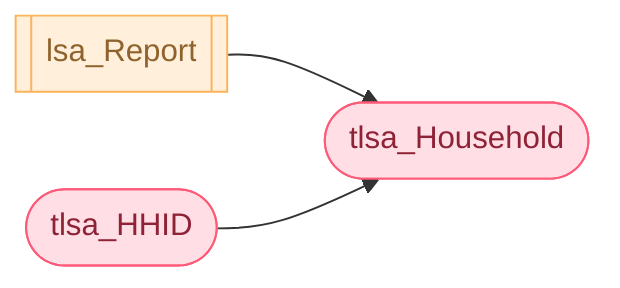
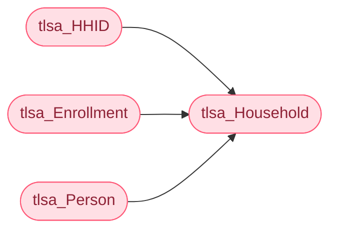
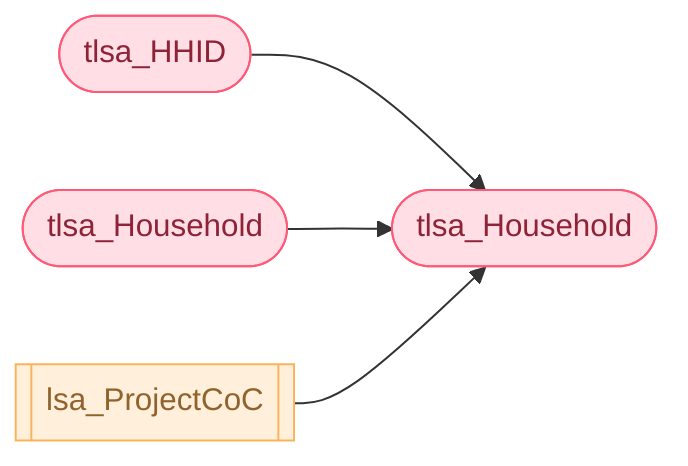
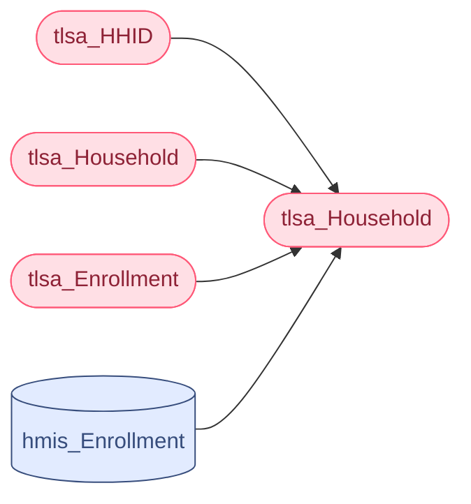
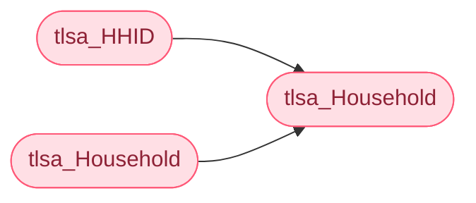
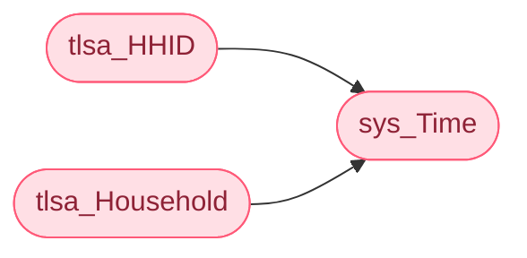
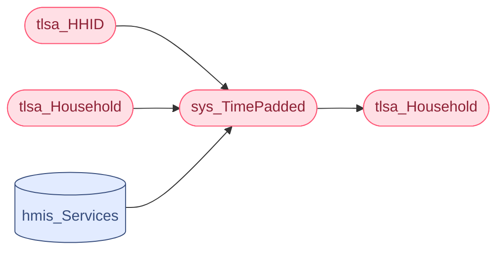
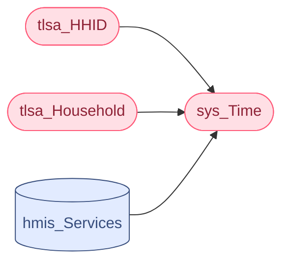
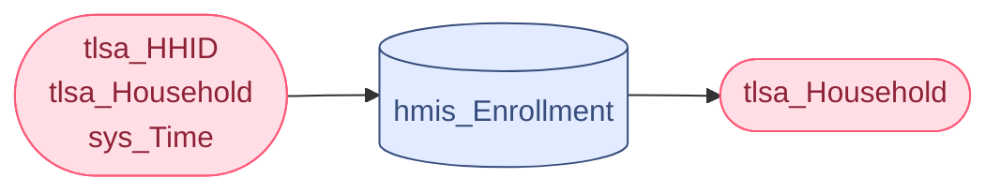

- Contents
{:toc}

# 6.1 Get Distinct Households for LSAHousehold

This section is required only if **<u>LSAScope</u>** <> 3 (HIC).

The tlsa\_Household data construct holds one record for each distinct combination of **HoHID** and **ActiveHHType** in tlsa\_HHID where **Active** \= 1. It is a household-level version of the aggregate LSAHousehold data and is used to set values for each LSA reporting category for each household. It includes all columns from LSAHousehold.csv other than **RowTotal** and **ReportID**, as well as several columns which are used as a reference to simplify business logic but do not correlate to a column in LSAHousehold.

## Source

| **lsa_Report** |
|----------------|
| ReportStart    |
| ReportEnd      |

| **tlsa_HHID**  |
|--------------------|
| HoHID          |
| ActiveHHType   |
| Active         |

## Target

The logic associated with values for columns with names in **bold** below is described in this step. The business logic associated with other columns is described in subsequent steps.

| **tlsa\_Household**    | **Column Description**                                                                                                                                                                                                                                                                                                                                                                    |
| ---------------------- | ----------------------------------------------------------------------------------------------------------------------------------------------------------------------------------------------------------------------------------------------------------------------------------------------------------------------------------------------------------------------------------------- |
| **HoHID**              | _PersonalID_ for heads of active households; distinct combinations of **HoHID** and **HHType** serve as a primary key.                                                                                                                                                                                                                                                                    |
| **HHType**             | The household type                                                                                                                                                                                                                                                                                                                                                                        |
| FirstEntry             | (Does not correlate to a column in LSAHousehold.csv) The earliest _EntryDate_ for any active enrollment.                                                                                                                                                                                                                                                                                  |
| LastInactive           | (Does not correlate to a column in LSAHousehold.csv) For households already engaged with the continuum at the start of the report period, the most recent date prior to ReportStart and the start of the household’s period of continuous engagement.                                                                                                                                     |
| Stat                   | The household status related to continuum engagement on the first day of the earliest enrollment active during the report period.                                                                                                                                                                                                                                                         |
| StatEnrollmentID       | (Does not correlate to a column in LSAPerson.csv) For households returning or re-engaging with the continuum 15-730 days after an exit prior to ReportStart (**Stat** in (2,3,4)), the _EnrollmentID_ for the household’s most recent exit prior to ReportStart.                                                                                                                          |
| ReturnTime             | For households returning or re-engaging with the continuum 15-730 days after an exit prior to ReportStart (**Stat** in (2,3,4)), the length of time in days between exit and the earliest active enrollment.                                                                                                                                                                              |
| HHAdult                | Number of people (including the head of household) 18 and older served with the HoH in active HMIS households where **HHType** = tlsa\_Household.**HHType**                                                                                                                                                                                                                               |
| HHChild                | Number of people (including the head of household) under the age of 18 served with the HoH in active HMIS households where **HHType** = tlsa\_Household.**HHType**                                                                                                                                                                                                                        |
| HHNoDOB                | Number of people (including the head of household) with no valid date of birth with the HoH in active HMIS households where **HHType** = tlsa\_Household.**HHType**                                                                                                                                                                                                                       |
| HHChronic              | Identifies whether or not the head of household or any adult household member is chronically homeless or has other specific patterns of long-term homelessness. Based on **DisabilityStatus**, **CHTime**, and **CHTimeStatus** values, as determined for LSAPerson reporting.                                                                                                            |
| HHVet                  | Identifies whether or not the household includes a veteran. Based on **VetStatus** value, as determined for LSAPerson reporting.                                                                                                                                                                                                                                                          |
| HHDisability           | Identifies whether or not the head of household or any adult member was identified as having a disabling condition on any active enrollment.                                                                                                                                                                                                                                              |
| HHFleeingDV            | Identifies whether or not the head of household or any adult member was identified as fleeing domestic violence on any active enrollment. Based on **DVStatus** value, as determined for LSAPerson reporting.                                                                                                                                                                             |
| HoHRaceEthnicity       | Identifies race and ethnicity for head of household as reported in LSAPerson.                                                                                                                                                                                                                                                                                                             |
| HHAdult                | Number of people (including the head of household) 18 and older served with the head of household in the household type reflected in the **HHType** column.                                                                                                                                                                                                                               |
| HHChild                | Number of people (including the head of household) under the age of 18 served with the head of household in the household type reflected in the **HHType** column.                                                                                                                                                                                                                        |
| HHNoDOB                | Number of people (including the head of household) with no valid date of birth served with the head of household.                                                                                                                                                                                                                                                                         |
| HHAdultAge             | The age groups of adult household members. The categories are mutually exclusive (a household can only fall into one group) and inclusive (every household with adults will fall into one group).                                                                                                                                                                                         |
| HHParent               | Identifies whether or not any household member has **RelationshiptoHoH** = 2 (child of the HoH).                                                                                                                                                                                                                                                                                          |
| ESTStatus              | Identifies whether the household was served in ES, SH, and/or TH during the report period or prior to the report period during a period of continuous system use. If served, the status indicates how the enrollment timeframe relates to the report period.                                                                                                                              |
| ESTGeography           | For households with active EST enrollments (**ESTStatus** > 2) during the report period, the Geography of the most recent project in which the household was enrolled.                                                                                                                                                                                                                    |
| ESTLivingSit           | For households with active EST enrollments (**ESTStatus** > 2) during the report period, the _LivingSituation_ associated with the earliest active enrollment.                                                                                                                                                                                                                            |
| ESTDestination         | For households who exited an EST enrollment during the report period and were not active in an EST project as of ReportEnd (**ESTStatus** in (12,22)), the _Destination_ associated with the most recent exit.                                                                                                                                                                            |
| ESTChronic             | Population identifier specific to EST; see **HHChronic**.                                                                                                                                                                                                                                                                                                                                 |
| ESTVet                 | Population identifier specific to EST; see **HHVet**.                                                                                                                                                                                                                                                                                                                                     |
| ESTDisability          | Population identifier specific to EST; see **HHDisability**.                                                                                                                                                                                                                                                                                                                              |
| ESTFleeingDV           | Population identifier specific to EST; see **HHFleeingDV.**                                                                                                                                                                                                                                                                                                                               |
| ESTAC3Plus             | Population identifier; for AC households, specifies whether or not there were at least three household members under the age of 18 served with the HoH in EST.                                                                                                                                                                                                                            |
| ESTAdultAge            | Population identifier specific to EST; see **HHAdultAge**.                                                                                                                                                                                                                                                                                                                                |
| ESTParent              | Population identifier specific to EST; see **HHParent**.                                                                                                                                                                                                                                                                                                                                  |
| RRHStatus              | Identifies whether the household was served in RRH during the report period or in an episode of homelessness that overlaps with the report period. If served, the status indicates how the enrollment timeframe relates to the report period.                                                                                                                                             |
| RRHMoveIn              | For households served in RRH during the report period, indicates if the household has a move-in date. If so, indicates whether it was before or during the report period.                                                                                                                                                                                                                 |
| RRHGeography           | For households with active RRH enrollments (**RRHStatus** > 2) during the report period, the Geography of the most recent project in which the household was enrolled.                                                                                                                                                                                                                    |
| RRHLivingSit           | For households with active RRH enrollments (**RRHStatus** > 2) during the report period, the _LivingSituation_ associated with the earliest active enrollment.                                                                                                                                                                                                                            |
| RRHDestination         | For households who exited an RRH enrollment during the report period and were not active in an RRH project as of ReportEnd (**RRHStatus** in (12,22)), the Destination associated with the most recent exit.                                                                                                                                                                              |
| RRHPreMoveInDays       | For households who were housed in RRH at any point in the report period, including those with a _MoveInDate_ prior to ReportStart, the total number of days between _EntryDate_ and _MoveInDate_ for any active RRH enrollment. It differs from other day counts in that it includes all days in RRH prior to move-in, even if the household was simultaneously enrolled in ES/SH/TH/PSH. |
| RRHChronic             | Population identifier specific to RRH; see **HHChronic**.                                                                                                                                                                                                                                                                                                                                 |
| RRHVet                 | Population identifier specific to RRH; see **HHVet**.                                                                                                                                                                                                                                                                                                                                     |
| RRHDisability          | Population identifier specific to RRH; see **HHDisability**.                                                                                                                                                                                                                                                                                                                              |
| RRHFleeingDV           | Population identifier specific to RRH; see **HHFleeingDV.**                                                                                                                                                                                                                                                                                                                               |
| RRHAC3Plus             | Population identifier; for AC households, specifies whether or not there were at least three household members under the age of 18 served with the HoH in RRH.                                                                                                                                                                                                                            |
| RRHAdultAge            | Population identifier specific to RRH; see **HHAdultAge**.                                                                                                                                                                                                                                                                                                                                |
| RRHParent              | Population identifier specific to RRH; see **HHParent**.                                                                                                                                                                                                                                                                                                                                  |
| PSHStatus              | Identifies whether the household was served in PSH during the report period or in an episode of homelessness that overlaps with the report period. If served, the status indicates how the enrollment timeframe relates to the report period.                                                                                                                                             |
| PSHMoveIn              | For households served in PSH during the report period, indicates if the household has a move-in date. If so, indicates whether it was before or during the report period.                                                                                                                                                                                                                 |
| PSHGeography           | For households with active PSH enrollments (**PSHStatus** > 2) during the report period, the Geography of the most recent project in which the household was enrolled.                                                                                                                                                                                                                    |
| PSHLivingSit           | For households with active PSH enrollments (**PSHStatus** > 2) during the report period, the _LivingSituation_ associated with the earliest active enrollment.                                                                                                                                                                                                                            |
| PSHDestination         | For households who exited a PSH enrollment during the report period and were not active in PSH as of ReportEnd (**PSHStatus** in (12,22)), the _Destination_ associated with the most recent exit.                                                                                                                                                                                        |
| PSHHousedDays          | From active enrollments, days spent housed in PSH. (Note that this differs from other day counts in that it is limited to active enrollments.)                                                                                                                                                                                                                                            |
| PSHChronic             | Population identifier specific to PSH; see **HHChronic**.                                                                                                                                                                                                                                                                                                                                 |
| PSHVet                 | Population identifier specific to PSH; see **HHVet**.                                                                                                                                                                                                                                                                                                                                     |
| PSHDisability          | Population identifier specific to PSH; see **HHDisability**.                                                                                                                                                                                                                                                                                                                              |
| PSHFleeingDV           | Population identifier specific to PSH; see **HHFleeingDV.**                                                                                                                                                                                                                                                                                                                               |
| PSHAC3Plus             | Population identifier; for AC households, specifies whether or not there were at least three household members under the age of 18 served with the HoH in PSH.                                                                                                                                                                                                                            |
| PSHAdultAge            | Population identifier specific to PSH; see **HHAdultAge**.                                                                                                                                                                                                                                                                                                                                |
| PSHParent              | Population identifier specific to PSH; see **HHParent**.                                                                                                                                                                                                                                                                                                                                  |
| ESDays                 | Days spent in ES or SH during the report period and/or in any continuous episode of homelessness/system use prior to the report period when the household was not in TH or housed in RRH/PSH.                                                                                                                                                                                             |
| THDays                 | Days spent in TH during the report period and/or in any continuous episode of engagement/homelessness prior to report period when the household was not in housed in RRH/PSH.                                                                                                                                                                                                             |
| ESTDays                | Days spent in ES/SH/TH in the report period and/or in any continuous episode of homelessness prior to report period when the household was not housed in RRH/PSH.                                                                                                                                                                                                                         |
| RRHPSHPreMoveInDays    | For households served in RRH and/or PSH, the total number of days spent homeless in RRH/PSH in the report period or in any continuous episode of engagement/homelessness prior to report period when household was not housed in RRH/PSH and not active in ES/SH/TH.                                                                                                                      |
| RRHHousedDays          | Days spent housed in RRH in the report period and/or in any continuous episode of engagement/homelessness prior to report period when the household was not housed in PSH.                                                                                                                                                                                                                |
| SystemDaysNotPSHHoused | The total number of days spent in ES, SH, TH, RRH, or PSH (pre-move-in) in the report period or in any continuous episode of homelessness prior to the report period while not housed in PSH.                                                                                                                                                                                             |
| SystemHomelessDays     | The combined total number of days in the report period or in any episode of continuous homelessness that overlaps the report period when the household was in ES/SH/TH or was enrolled, but not housed in RRH/PSH (i.e. does not have a move-in date).                                                                                                                                    |
| Other3917Days          | The total number of days in the report period or in any episode of continuous homelessness that overlaps the report period when the household was on the street or in ES/SH based on 3.917 Living Situation records for any System Path enrollment, but was not active in a continuum ES/SH/TH/RRH/PSH project.                                                                           |
| TotalHomelessDays      | The combined total number of days in the report period or in any episode of continuous homelessness that overlaps the report period when the household was in ES/SH/TH; was enrolled, but not housed in RRH/PSH (i.e. does not have a move-in date); or on the street or in ES/SH based on 3.917 Living Situation records for any System Path enrollment and was not housed in RRH/PSH.   |
| SystemPath             | The combinations of system use during the report period and in any continuous period of service prior to the report period – i.e., the ‘path’ through the system. It is not dependent on the sequence of service. System Paths are mutually exclusive.                                                                                                                                    |
| ESTAIR                 | Identifies households active in residence for ES/SH/TH in the report period.                                                                                                                                                                                                                                                                                                              |
| RRHAIR                 | Identifies households active in residence for RRH in the report period.                                                                                                                                                                                                                                                                                                                   |
| PSHAIR                 | Identifies households active in residence for PSH in the report period.                                                                                                                                                                                                                                                                                                                   |

## Logic

# 6.2 Set Population Identifiers for LSAHousehold

**HHAdult**, **HHChild**, and **HHNoDOB** are used together to report on household composition. The additional household-level population identifiers are used to report on population groups of interest.

## Source

| **tlsa_HHID**       |
|---------------------|
| HoHID               |
| HouseholdID         |
| ActiveHHType        |
| HHChronic           |
| HHVet               |
| HHDisability        |
| HHFleeingDV         |
| HHAdultAge          |
| HHParent            |
| AC3Plus             |
| Active              |

| **tlsa_Enrollment** |
|--------------------|
| HouseholdID         |
| PersonalID          |
| ActiveAge           |
| Active              |

| **tlsa_Person**     |
|--------------------|
| PersonalID          |
| RaceEthnicity       |

## Target

| **tlsa_Household**   |
|----------------------|
| **HHAdult**          |
| **HHChild**          |
| **HHNoDOB**          |
| **HoHRaceEthnicity** |
| **HHChronic**        |
| **HHVet**            |
| **HHDisability**     |
| **HHFleeingDV**      |
| **HHAdultAge**       |
| **HHParent**         |
| **AC3Plus**          |

## Logic

### HHAdult

The value is a count (up to 3) of household members who was served as an adult on *every* associated active enrollment (**ActiveAge** between 21 and 65). Anyone served as both an adult and a child with the same **HoHID**/**ActiveHHType** should be counted as a child. (This is only possible in AC households when a household member turns 18 between enrollments and there is another household member still under 18.)

| Value | Category                      |
|-------|-------------------------------|
| 0     | No adult in household         |
| 1     | 1 adult in household          |
| 2     | 2 adults in household         |
| 3     | 3 or more adults in household |

If **HHType** is 1 (AO) or 2 (AC), the value in this column must be \> 0.

If **HHType** = 3 (CO), the value in this column must = 0.

### HHChild

The value is a count of all active household members (up to 3) whose **ActiveAge** for *any* associated active enrollment is under 18.

| Value | Category                        |
|-------|---------------------------------|
| 0     | No child in household           |
| 1     | 1 child in household            |
| 2     | 2 children in household         |
| 3     | 3 or more children in household |

If **HHType** is 1 (AO), the value in this column must = 0.

If **HHType** is 2 (AC) or 3 (CO), the value in this column must be \> 0.

**Note:** If **HHChild** = 3 and **HHType** = 2, the household is counted in the AC Households with 3 or More Children population.

The value is a count of all active household members (up to 3) whose **ActiveAge** is in (98,99).

| Value | Category                                          |
|-------|---------------------------------------------------|
| 0     | No person without a valid DOB in household        |
| 1     | 1 person without a valid DOB in household         |
| 2     | 2 people without a valid DOB in household         |
| 3     | 3 or more people without a valid DOB in household |

If **HHType** is 1 (AO) or 3 (CO), the value in this column must be = 0.

If **HHType** = 99 (UN), the value in this column must be \> 0.

### HoHRaceEthnicity

Set values for **HoHRaceEthnicity** in tlsa_Household to the **RaceEthnicity** value for the head of household in tlsa_Person.

### HHVet, HHDisability, and HHParent

Set the value in tlsa_Household to the maximum value for the corresponding column in tlsa_HHID – i.e., if the value is 1 for any **HouseholdID** with the same **HoHID** and **ActiveHHType =** **HHType**, set the value in tlsa_Household to 1. Otherwise, set the value to 0.

These columns are used to identify populations of interest:
- Veteran Household (**HHVet** = 1)
- Household with a Disabled Adult/HoH **(HHDisability** = 1)
- Parenting Children (**HHType** = 3 and **HHParent** = 1)
- Parenting Youth 18-24 – (**HHParent** = 1 and **HHType** = 2 and **HHAdultAge** in (18,24))

### HHFleeingDV

Set **HHFleeingDV** to the first value in the table below that occurs in tlsa_HHID.**HHFleeingDV** for the same **HoHID** where **ActiveHHType**= **HHType**:

| Priority | HHFleeingDV Value |
|----------|-------------------|
| 1        | 1                 |
| 2        | 2                 |
| 3        | 0                 |

This column is used to identify populations of interest:
- Households Fleeing Domestic Violence **(HHFleeingDV** = 1)
- Households of Domestic Violence Survivors Not Currently Fleeing  (**HHFleeingDV** = 2)
- Households with No Reported DV History (**HHFleeingDV** = 0)

### HHChronic

Set **HHChronic** to the first value in the table below that occurs in tlsa_HHID.**HHChronic** for the same **HoHID** where **ActiveHHType** = **HHType**:

| Value | Category                                               |
|:-----:|--------------------------------------------------------|
|   1   | Chronically Homeless                                   |
|   2   | Long-Term Homeless with Disability                     |
|   3   | Long-Term Homeless Missing Disability Info             |
|   4   | Long-Term Homeless without Disability                  |
|   5   | Homeless \> 6 Months with Disability (missing data)    |
|   6   | Homeless \> 6 Months with Disability (no missing data) |
|   9   | CH Status Unknown (missing data)                       |
|   0   | Not Chronically Homeless                               |

### HHAdultAge

Set **HHAdultAge** based on the first of the criteria below met by any active tlsa_HHID record with the same **HoHID** and **ActiveHHType =** **HHType:**

| Priority | tlsa_HHID           | tlsa_Household.HHAdultAge |
|----------|---------------------|---------------------------|
| 1        | **HHAdultAge** = 18 | 18                        |
| 2        | **HHAdultAge** = 24 | 24                        |
| 3        | **HHAdultAge** = 55 | 55                        |
| 4        | **HHAdultAge** = 25 | 25                        |
| 5        | (any other)         | -1                        |

The populations for which **HHAdultAge** are relevant are:
- AO Unaccompanied Youth 18-21– all household members are between the ages of 18 and 21 (**HHType** = 1 and **HHAdultAge** = 18)
-  AO Unaccompanied Youth 22-24 – at least one household member is between 22 and 24; all are between 18 and 24 **(HHType** = 1 and **HHAdultAge** = 24)
-  AO Non-Veteran Households 25+ - at least one household member is over 24 (**HHType** = 1 and **HHVet** = 0 and **HHAdultAge** in (25,55))
-  AO Senior Households 55+ - all household members are 55 or older (**HHType** = 1 and **HHAdultAge** = 55)
-  AC Parenting Youth 18-24 – all adults in the household are between 18 and 24; there are no household members of unknown age (**HHParent** = 1 and **HHType** = 2 and **HHAdultAge** in (18,24))

In general, each distinct combination of **HoHID**/**HHType** is counted in all populations identified for associated **HouseholdID**s. Technically, a non-veteran served alone –once at age 24 and again at 25 – is a member of two populations:

-   Unaccompanied Young Adults 18-24; and
-   Non-Veteran Households 25+.

With a single upload value for **HHAdultAge** in LSAHousehold, it isn’t possible to identify both. Inclusion in youth and senior populations is prioritized over the Non-Veteran Households 25+ population.

# 6.3 EST/RRH/PSH/RRHSOStatus – LSAHousehold 

## Source 

| **tlsa_HHID**  |
|----------------|
| HoHID          |
| HHType         |
| LSAProjectType |
| EntryDate      |
| ExitDate       |
| Active         |
| ActiveHHType   |

## Target

| **tlsa_Household** |
|--------------------|
| ESTStatus      |
| RRHStatus      |
| PSHStatus      |
| RRHSOStatus    |

## Logic 

Like tlsa\_Person, tlsa\_Household includes columns to indicate the project groups in which each household was served.

The logic and upload values associated with **ESTStatus**, **RRHStatus**, **PSHStatus**, and **RRHSOStatus** are identical, aside from the project group. The following sections use ‘x’ in place of the project group identifier – e.g., **xStatus** instead of **ESTStatus**.

Values are based on:

-   Earliest *EntryDate* for an active enrollment in project group; and
-   A NULL value for *ExitDate* on any active enrollment in the project group OR the latest *ExitDate.*

For every record in tlsa\_Household:

| Earliest x *EntryDate* | Latest x *ExitDate*                                           | xStatus Value |
| ---------------------- | ------------------------------------------------------------- | ------------- |
| NULL                   | n/a                                                           | 0             |
| \< <u>ReportStart</u>  | NULL / there is an active enrollment for x with no *ExitDate* | 11            |
| \< <u>ReportStart</u>  | Between <u>ReportStart</u> and <u>ReportEnd</u>               | 12            |
| \>= <u>ReportStart</u> | NULL / there is an active enrollment for x with no *ExitDate* | 21            |
| \>= <u>ReportStart</u> | Between <u>ReportStart</u> and <u>ReportEnd</u>               | 22            |

Note: 2 is also a valid value for **xStatus** but is not assigned until a later step in section [6.16 Update EST/RRH/PSHStatus](#update-estrrhpshrrhsostatus).

# 6.4 RRH/PSH/RRHSOMoveIn – LSAHousehold 

## Source 

| **tlsa_HHID**  |
|----------------|
| HoHID          |
| HHType         |
| ActiveHHType   |
| MoveInDate     |
| EntryDate      |
| LSAProjectType |

## Target

| **tlsa_Household** |
|--------------------|
| RRHMoveIn      |
| PSHMoveIn      |
| RRHSOMoveIn    |

## Logic 

Aside from the project type, the logic and upload values associated with **RRHMoveIn** and **PSHMoveIn** are identical. They are based on **RRHStatus** and **PSHStatus**, respectively, and move-in dates for relevant enrollments.

For all records in tlsa\_Household:

| xStatus Value | MoveInDate | xMoveIn Value |
|----|----|----|
| \<= 2 | Any | -1 |
| \> 2 | There is no *MoveInDate* | 0 |
| \> 2 | Most recent *MoveInDate* is between <u>ReportStart</u> and <u>ReportEnd</u> | 1 |
| \> 2 | Most recent *MoveInDate* \< <u>ReportStart</u> | 2 |

# 6.5 EST/RRH/PSHGeography – LSAHousehold 

## Source

| **lsa_ProjectCoC** |
|--------------------|
| ProjectID          |
| GeographyType      |

| **tlsa_Household** |
|--------------------|
| HoHID              |
| HHType             |
| EST/RRH/PSHStatus  |

| **tlsa_HHID**      |
|--------------------|
| HoHID              |
| ActiveHHType       |
| Active             |
| ProjectID          |
| LSAProjectType     |
| EntryDate          |
| ExitDate           |

## Target

| **tlsa_Household** |
|--------------------|
| ESTGeography   |
| RRHGeography   |
| PSHGeography   |

## Logic

Set **xGeography** = -1 for households not served in project group during the report period (**xStatus** < 10).

For households served in the project group during the report period (**xStatus** >= 10), **xGeography** is based on:
-   The active enrollment for the project group with the latest active date in the report period; and
-   The lsa\_ProjectCoC.*GeographyType* for the project.

If a household has more than one project group enrollment on their most recent active date, use the enrollment with the latest *EntryDate*.

| HMIS Value | HMIS Response Category | LSA Value |
|------------|------------------------|-----------|
| 1          | Urban                  | 1         |
| 2          | Suburban               | 2         |
| 3          | Rural                  | 3         |

# 6.6 EST/RRH/PSHLivingSit – LSAHousehold 

## Source

| **tlsa_Household**  |
|---------------------|
| HoHID               |
| HHType              |
| EST/RRH/PSHStatus   |

| **tlsa_HHID**       |
|--------------------|
| HoHID               |
| ActiveHHType        |
| Active              |
| LSAProjectType      |
| EntryDate           |

| **tlsa_Enrollment** |
|--------------------|
| EnrollmentID        |
| EntryDate           |
| **hmis_Enrollment** |

|--------------------|
| EnrollmentID        |
| PersonalID          |
| EntryDate           |
| LivingSituation     |
| RentalSubsidyType   |

## Target

| **tlsa_Household** |
|--------------------|
| ESTLivingSit   |
| RRHLivingSit   |
| PSHLivingSit   |

## Logic

Set **xLivingSit** = -1 for households not served in project group during the report period (**xStatus** < 10).

Set **ESTLivingSit** \= 99 for any household where tlsa\_HHID.**EntryDate** <> hmis\_Enrollment.*EntryDate* (i.e., night-by-night enrollments where the HMIS entry date did not correspond to a *BedNightDate*).

For other households (**xStatus** > 2), **xLivingSit** is based on *LivingSituation* and *RentalSubsidyType* for the enrollment with the earliest *EntryDate* for the project group..

-   If *LivingSituation* in (8,9), set xLivingSit = 98
-   If *LivingSituation* is NULL or 99, set **xLivingSit** \= 99
-   If *LivingSituation* = 435 and *RentalSubsidyType* is null, set **xLivingSit** \= 99
-   If *LivingSituation* = 435, set **xLivingSit** \= *RentalSubsidyType*
-   Otherwise, set **xLivingSit** \= *LivingSituation*.

| Value | xLivingSit                                                                                                                    |
| ----: | ----------------------------------------------------------------------------------------------------------------------------- |
|    -1 | Not applicable                                                                                                                |
|    98 | Data not provided by client                                                                                                   |
|    99 | Data missing or invalid                                                                                                       |
|   101 | Emergency shelter, including hotel or motel paid for with emergency shelter voucher, Host Home shelter                        |
|   116 | Place not meant for habitation (e.g., a vehicle, an abandoned building, bus/train/subway station/airport or anywhere outside) |
|   118 | Safe Haven                                                                                                                    |
|   204 | Psychiatric hospital or other psychiatric facility                                                                            |
|   205 | Substance abuse treatment facility or detox center                                                                            |
|   206 | Hospital or other residential non-psychiatric medical facility                                                                |
|   207 | Jail, prison, or juvenile detention facility                                                                                  |
|   215 | Foster care home or foster care group home                                                                                    |
|   225 | Long-term care facility or nursing home                                                                                       |
|   302 | Transitional housing for homeless persons (including homeless youth)                                                          |
|   314 | Hotel or motel paid for without emergency shelter voucher                                                                     |
|   329 | Residential project or halfway house with no homeless criteria                                                                |
|   332 | Host Home (non-crisis)                                                                                                        |
|   335 | Staying or living in a family member’s room, apartment, or house                                                              |
|   336 | Staying or living in a friend’s room, apartment, or house                                                                     |
|   410 | Rental by client, no ongoing housing subsidy                                                                                  |
|   411 | Owned by client, no ongoing housing subsidy                                                                                   |
|   419 | Rental by client - VASH housing subsidy                                                                                       |
|   420 | Rental by client - Other ongoing subsidy                                                                                      |
|   421 | Owned by client, with ongoing housing subsidy                                                                                 |
|   428 | Rental by client - GPD TIP housing subsidy                                                                                    |
|   431 | Rental by client - RRH or equivalent subsidy                                                                                  |
|   433 | Rental by client - HCV voucher (tenant or project based) (not dedicated)                                                      |
|   434 | Rental by client - Public housing unit                                                                                        |
|   436 | Rental by client - Emergency Housing Voucher                                                                                  |
|   437 | Rental by client - Family Unification Program Voucher (FUP)                                                                   |
|   438 | Rental by client - Foster Youth to Independence Initiative (FYI)                                                              |
|   439 | Rental by client - Permanent Supportive Housing                                                                               |
|   440 | Rental by client - Other permanent housing dedicated for formerly homeless persons                                            |

# 6.7 EST/RRH/PSHDestination – LSAHousehold 

## Source

| **tlsa_Household** |
|--------------------|
| HoHID              |
| HHType             |
| EST/RRH/PSHStatus  |

| **tlsa_HHID**      |
|--------------------|
| HoHID              |
| ActiveHHType       |
| Active             |
| ExitDate           |
| ExitDest           |
| LSAProjectType     |

## Target

| **tlsa_Household** |
|--------------------|
| ESTDestination |
| RRHDestination |
| PSHDestination |

## Logic

See section [3.3 HMIS Household Enrollments](#_ExitDest) for logic associated with setting destination for individual enrollments.

Set **xDestination** = -1 for households not served in project group and households enrolled in project group at <u>ReportEnd</u> (**xStatus** not in (12,22)).

For households that exited the project group during the report period (**xStatus** in (12,22)), **xDestination** is based on the active enrollment with the most recent **ExitDate** for the project group using the tlsa\_HHID.**ExitDest** value.

# 6.8 EST/RRH/PSH Population Identifiers 

## Source

| **tlsa_HHID**  |
|----------------|
| HoHID          |
| LSAProjectType |
| ActiveHHType   |
| HHChronic      |
| HHVet          |
| HHDisability   |
| HHFleeingDV    |
| HHAdultAge     |
| HHParent       |
| AC3Plus        |

## Target

| **tlsa_Household**        |
|---------------------------|
| EST/RRH/PSHChronic    |
| EST/RRH/PSHVet        |
| EST/RRH/PSHDisability |
| EST/RRH/PSHFleeingDV  |
| EST/RRH/PSHAC3Plus    |
| EST/RRH/PSHAdultAge   |
| EST/RRH/PSHParent     |

In section 6.2, a household is included in any given population as long as at least one active **HouseholdID** with the same **HoHID**/**ActiveHHType** meets the criteria.

The population identifiers listed here use similar logic, but are specific to project group – they are only set if there is a record in tlsa\_HHID for the **HoHID**/**ActiveHHType** and the project type is consistent with the relevant project group:

-   EST – LSAProjectType in (0,1,2,8)
-   RRH – LSAProjectType = 13
-   PSH – LSAProjectType = 3

There are no project-group-specific columns for **HoHRaceEthnicity** as it is not subject to change with household composition.

### EST/RRH/PSHAC3Plus

For records in tlsa\_Household where **HHType** = 2 and **HHChild** = 3, set **EST/RRH/PSHAC3Plus** to 1 if there is any active **HouseholdID** in tlsa\_HHID for the **HoHID** where **ActiveHHType** = **2** and **AC3Plus** = 1 and **LSAProjectType** is consistent with the project group. For all other records, set to 0.

### EST/RRH/PSHVet

If there is any active **HouseholdID** for the **HoHID** where **ActiveHHType** = **HHType** and **HHVet** = 1 and **LSAProjectType** is consistent with the project group, set the value for **EST/RRH/PSHVet** to 1. Otherwise, set to 0.

### EST/RRH/PSHChronic

If there is any active **HouseholdID** for the **HoHID** where **ActiveHHType** = **HHType** and **HHChronic** = 1 and **LSAProjectType** is consistent with the project group, set the value for **EST/RRH/PSHChronic** to 1. Otherwise, set to 0.

### EST/RRH/PSHDisability

If there is any active **HouseholdID** for the **HoHID** where **ActiveHHType** = **HHType** and **HHDisability** = 1 and **LSAProjectType** is consistent with the project group, set the value for **EST/RRH/PSHDisability** to 1. Otherwise, set to 0.

### EST/RRH/PSHFleeingDV

Set **EST/RRH/PSHFleeingDV** to the first value in the table below that occurs in tlsa\_HHID.**HHFleeingDV** for the same **HoHID** where **ActiveHHType** = **HHType** and **LSAProjectType** is consistent with the project group:

| Priority | HHFleeingDV Value |
|----------|-------------------|
| 1        | 1                 |
| 2        | 2                 |
| 3        | 0                 |

### EST/RRH/PSHParent

If there is any active HHID for the **HoHID** where **ActiveHHType** = **HHType** and **HHParent** \= 1 and **LSAProjectType** is consistent with the project group, set the value for **EST/RRH/PSHParent** to 1. Otherwise, set to 0.

### EST/RRH/PSHAdultAge

Set **EST/RRH/PSHAdultAge** based on the first of the criteria below met by any active HHID record for the relevant project group with the same **HoHID** where **ActiveHHType** = **HHType**:

| Priority | tlsa_HHID           | EST/RRH/PSHAdultAge |
|----------|---------------------|---------------------|
| 1        | **HHAdultAge** = 18 | 18                  |
| 2        | **HHAdultAge** = 24 | 24                  |
| 3        | **HHAdultAge** = 55 | 55                  |
| 4        | **HHAdultAge** = 25 | 25                  |
| 5        | (any other)         | -1                  |

# 6.9 System Engagement Status and Return Time

## Source

| **tlsa_Household** |
|--------------------|
| HoHID              |
| HHType             |

| **tlsa_HHID**      |
|--------------------|
| HoHID              |
| EntryDate          |
| ExitDate           |
| ExitDest           |
| ActiveHHType       |
| EnrollmentID       |
| Active             |

## Target

| **tlsa_Household**   |
|----------------------|
| FirstEntry       |
| Stat             |
| StatEnrollmentID |
| ReturnTime       |

## Logic

System engagement status specifies whether or not active households were actively engaged with continuum ES, SH, TH, RRH, and/or PSH projects in the two years prior to their earliest active date in the report period in the following categories:

| Value | Stat |
|----|----|
| 1 | First-time homeless |
| 2 | Return to continuum 15-730 days after exit to permanent destination |
| 3 | Re-engage with continuum 15-730 days after exit to temporary destination |
| 4 | Re-engage with continuum 15-730 days after exit to unknown destination |
| 5 | Continuous engagement with continuum |

### FirstEntry 

A household’s **FirstEntry** is the earliest *EntryDate* associated with any active enrollment.

### Previous Activity / StatEnrollmentID

**StatEnrollmentID** is the tlsa\_HHID.**EnrollmentID** with the most recent (effective) **ExitDate** where:

-   **HoHID** = tlsa\_Household.**HoHID**
-   **ActiveHHType** \= tlsa\_Household.**HHType**
-   **ExitDate** for the earlier enrollment >= \[**FirstEntry** – 730 days\] and tlsa\_HHID.**ExitDate** < **FirstEntry**

### ReturnTime

If StatEnrollmentID is NULL, **ReturnTime** = -1

Otherwise, set **ReturnTime** based on the number of days between StatEnrollmentID.**ExitDate** and **FirstEntry**:

| Value | Category     |
|-------|--------------|
| -1    | 0-14 days    |
| 30    | 15-30 days   |
| 60    | 31-60 days   |
| 90    | 61-90 days   |
| 180   | 91-180 days  |
| 365   | 181-365 days |
| 547   | 366-547 days |
| 730   | 548-730 days |

### Stat

If **FirstEntry** < <u>ReportStart</u>, **Stat** = 5 – the active enrollment is part of a period of continuous engagement with the continuum that began prior to the report period. This will include any household whose **EST**/**RRH**/**PSHStatus** is either 11 or 12, which indicate entry prior to the start of the report period

If **FirstEntry** >= <u>ReportStart</u>, it is necessary to look for inactive enrollments for the household in the two years prior to determine status.

Stat is based on **StatEnrollmentID** (if any) and the associated **ExitDate** and **ExitDest**.

| Stat | Category | ExitDest | Other Condition |
|----|----|----|----|
| 1 | First-time homeless | (n/a) | **StatEnrollmentID** is NULL |
| 2 | Return 15-730 days after exit to permanent destination | Between 400 and 499 | **ReturnTime** between 15 and 730 |
| 3 | Re-engage 15-730 days after exit to temporary destination | Between 100 and 399 | **ReturnTime** between 15 and 730 |
| 4 | Re-engage 15-730 days after exit to other/unknown destination | \< 100 | **ReturnTime** between 15 and 730 |
| 5 | Continuous engagement with continuum | (n/a) | **StatEnrollmentID** is not NULL and **ReturnTime** = -1 |

# 6.10 RRHPreMoveInDays – LSAHousehold

## Source

| **tlsa_Household** |
|--------------------|
| HoHID              |
| HHType             |

| **tlsa_HHID**      |
|--------------------|
| HoHID              |
| ActiveHHType       |
| LSAProjectType     |
| EntryDate          |
| MoveInDate         |
| ExitDate           |
| Active             |

## Target

| **tlsa\_Household**  | **Column Description**                                                                                                                                                                                                                                                                                                                                              |
| -------------------- | ------------------------------------------------------------------------------------------------------------------------------------------------------------------------------------------------------------------------------------------------------------------------------------------------------------------------------------------------------------------- |
| **RRHPreMoveInDays** | Counts of actual days are set in tlsa\_Household; counts of active households are grouped by ranges – e.g., ‘1-7 days’, ‘8-30 days’, etc. – in the corresponding **LSAHousehold** column. Averages based on the counts of actual days are inserted to LSACalculated. (See section [8.4 Get Average Days for Length of Time in RRH Projects](#_Get_Average_Days_2).) |

## Logic

The logic associated with the LSAHousehold.**RRHPreMoveInDays** column differs from others that count days engaged in various parts of the system, referred to collectively as ‘system use days.’ The other counts resolve potential data conflicts so that each day has a single status and is counted only once. For example, days spent in RRH prior to move-in that overlap with days in emergency shelter are counted as ES days.

The **RRHPreMoveInDays** column is a count of distinct dates when a household was enrolled in an RRH housing project but not housed, regardless of other system use data.

For each active HHID where **HoHID**/**ActiveHHType** = tlsa\_Household. **HoHID**/**HHType** and **LSAProjectType** \= 13, set **RRHPreMoveInDays** = a count of the distinct dates between any tlsa\_HHID.**EntryDate** and the earliest associated non-NULL value for:

-   **MoveInDate** – 1 day
-   **ExitDate**
-   <u>ReportEnd</u>

# 6.11 Dates Housed in PSH or RRH (sys_Time)

The primary key for sys\_Time is the unique combination of **HoHID**, **HHType**, and **sysDate** – i.e., no date can be counted with more than one status for any given LSA household.
## Source

| **tlsa_Household** |
|--------------------|
| HoHID              |
| HHType             |

| **tlsa_HHID**      |
|--------------------|
| HoHID              |
| ActiveHHType       |
| LSAProjectType     |
| MoveInDate         |
| ExitDate           |
| Active             |

## Target

| **sys\_Time** | **Column Description**                                                                                                                                                                                                                                                                |
| ------------- | ------------------------------------------------------------------------------------------------------------------------------------------------------------------------------------------------------------------------------------------------------------------------------------- |
| **HoHID**     | HoHID – tlsa\_Household                                                                                                                                                                                                                                                               |
| **HHType**    | HHType – tlsa\_Household                                                                                                                                                                                                                                                              |
| **sysDate**   | Distinct dates enrolled in a continuum project and/or Street/ES/SH dates from _3.917 Living Situation_                                                                                                                                                                                |
| **sysStatus** | This step identifies dates when the household was:  -   1 = Housed in PSH -   2 = Housed in RRH  Subsequent steps identify dates:  -   3 = In TH -   4 = In ES/SH -   5 = In PSH pre-move-in -   6 = In RRH pre-move-in -   7 = Street/ES/SH (3.917) |

## Logic

LSAHousehold includes counts of the total number of days that a head of household was either homeless and/or engaged in various parts of the system, referred to collectively as ‘system use days.’ The counts are grouped by the client’s system status – i.e., ‘Days in TH’ or ‘Days Housed in PSH’ – on each relevant date.

Similar to the process of counting days for chronic homelessness, a head of household’s system use status for any given date is assigned in priority order, using the *first* status from the list below for which the HoH meets the identified criteria based on values in tlsa\_HHID and, for night-by-night enrollments, bed night dates in hmis\_Services.

| Priority | Status                         | \[Date\]                                                                                       |
| -------- | ------------------------------ | ---------------------------------------------------------------------------------------------- |
| 1        | Housed in PSH                  | \>= **MoveInDate** and <= The first non-NULL of (**ExitDate** – 1 day) or ReportEnd            |
| 2        | Housed in RRH                  | _\=_ **MoveInDate**                                                                            |
| 2        | Housed in RRH                  | \> **MoveInDate** and <= The first non-NULL of (**ExitDate** – 1 day) or ReportEnd             |
| 3        | In TH                          | \>= **EntryDate** and <= The first non-NULL of (**ExitDate** – 1 day) or ReportEnd             |
| 4        | In entry-exit ES/SH            | \>= **EntryDate** and <= The first non-NULL of (**ExitDate** – 1 day) or ReportEnd             |
| 4        | In night-by-night ES           | \= _BedNightDate_                                                                              |
| 5        | Enrolled but not housed in PSH | \>= _EntryDate_ and <= The first non-NULL of (_MoveInDate_ – 1 day_), ExitDate,_ and ReportEnd |
| 6        | Enrolled but not housed in RRH | \>= _EntryDate_ and <= The first non-NULL of (_MoveInDate_ – 1 day_), ExitDate,_ and ReportEnd |
| 7        | Street/ES/SH (3.917)           | \>= _DateToStreetESSH_ and < _EntryDate_                                                       |

In the CH process, enrollment dates are relevant regardless of household type or head of household status for the enrollment. However, system use days for a household are only counted for enrollments where the two defining characteristics of a household – **HoHID** and **ActiveHHType** – match tlsa\_Household.

### Dates Housed in PSH 

Dates housed in PSH are counted only for active enrollments.

For each **HoHID**/**HHType** in tlsa\_Household, create a record with a **sysStatus** = 1 in sys\_Time for any \[Date\] <= <u>ReportEnd</u> where:

-   tlsa\_HHID.**HoHID =** tlsa\_Household**.HoHID;** and
-   tlsa\_HHID.**ActiveHHType** \= tlsa\_Household.**HHType**; and
-   tlsa\_HHID.**Active** = 1; and
-   tlsa\_HHID.**LSAProjectType** \= 3; and
-   tlsa\_HHID.**MoveInDate** <= \[Date\]; and
-   tlsa\_HHID.**ExitDate** \> \[Date\] or is NULL
  
### Dates Housed in RRH 

Dates housed in RRH are counted only for active enrollments. As noted in section 3.3 ([HMIS Data Requirements and Assumptions](#RRHMoveInOnExitDate)) and reflected in the criteria listed below, the *MoveInDate* for an RRH enrollment is counted as a date housed even if it is equal to the *ExitDate*.

For each **HoHID**/**HHType** in tlsa\_Household, create a record with a **sysStatus** = 2 in sys\_Time for any \[Date\] <= <u>ReportEnd</u> where:

-   There is no existing record for the **HoHID**/**HHType**/**Date** in sys\_Time (i.e., the household was not housed in PSH on the date); and
-   tlsa\_HHID.**HoHID =** tlsa\_Household**.HoHID;** and
-   tlsa\_HHID.**ActiveHHType** \= tlsa\_Household.**HHType**; and
-   tlsa\_HHID.**Active** = 1; and
-   **LSAProjectType** = 13; and
-   **MoveInDate** <= \[Date\]; and
-   **ExitDate** \> \[Date\] or is NULL
  
# 6.12 Get Last Inactive Date (sys_TimePadded)

This step identifies, based on active enrollments and potentially relevant inactive enrollments, the date immediately prior to the first day of continuous system engagement for which all system use days are counted – or the household’s last inactive date.

Specifically, this is the latest date in the most recent period of at least seven nights during which a household was not enrolled in a continuum ES, SH, TH, RRH, or PSH project AND was not housed in RRH or PSH. This is the date after which all system use days are reportable.

RRH-SO enrollments are not relevant to **LastInactive**.

## Source

| **tlsa_Household**                                       |
|----------------------------------------------------------|
| HoHID                                                    |
| HHType                                                   |
| FirstEntry                                               |

| **tlsa_HHID**                                            |
|--------------------|
| HoHID                                                    |
| ActiveHHType                                             |
| EntryDate                                                |
| ExitDate                                                 |

| **hmis_Services**                                        |
|--------------------|
| EnrollmentID                                             |
| *BedNightDate* (*DateProvided* where *RecordType* = 200) |

## Target

| **sys\_TimePadded** | **Column Description**                                                                                                                                                                                                                      |
| ------------------- | ------------------------------------------------------------------------------------------------------------------------------------------------------------------------------------------------------------------------------------------- |
| HoHID               | From tlsa\_Household                                                                                                                                                                                                                        |
| HHType              | From tlsa\_Household                                                                                                                                                                                                                        |
| StartDate           | -   For tlsa\_HHID **EnrollmentID**s in night-by-night ES, each *BedNightDate* associated with the enrollment between <u>LookbackDate</u> and <u>ReportEnd</u> -   For all other tlsa\_HHID enrollments, the **EntryDate**               |
| EndDate             | -   For tlsa\_HHID **EnrollmentID**s in night-by-night ES, the earlier of \[**StartDate** + 6 days\] or <u>ReportEnd</u> -   For all other tlsa\_HHID enrollments, the earlier non-NULL of \[**ExitDate** + 6 days\] or <u>ReportEnd</u> |
| **tlsa\_Household** |                                                                                                                                                                                                                                             |
| LastInactive        | See below                                                                                                                                                                                                                                   |

## Logic

**LastInactive** is the later of \[<u>LookbackDate</u> – 1 day\] and the most recent date where:

-   \[Date\] < tlsa\_Household.**FirstEntry**
-   \[Date\] is not between a *BedNightDate* and (*BedNightDate* + 6 days) for any enrollment – active or inactive -- in tlsa\_HHID where **ActiveHHType** = tlsa\_Household.**HHType**
    -   Note that a *BedNightDate* must be valid – i.e., >= **EntryDate** for the associated enrollment and < **ExitDate** if there is one – in order to be relevant. In systems that allow the creation of invalid bed night data, report code must exclude those records.
-   \[Date\] is not between a tlsa\_HHID.**EntryDate** and the associated (**ExitDate** + 6 days) for any enrollment – active or inactive -- in tlsa\_HHID where **ActiveHHType** = tlsa\_Household.**HHType**
-   
# 6.13 Get Dates of Other System Use (sys_Time)

## Source

| **tlsa_Household**                                       |
|----------------------------------------------------------|
| HoHID                                                    |
| HHType                                                   |
| LastInactive                                             |

| **tlsa_HHID**                                            |
|--------------------|
| HoHID                                                    |
| ActiveHHType                                             |
| LSAProjectType                                           |
| EntryDate                                                |
| MoveInDate                                               |
| ExitDate                                                 |

| **hmis_Services**                                        |
|--------------------|
| EnrollmentID                                             |
| *BedNightDate* (*DateProvided* where *RecordType* = 200) |

## Target

| **sys_Time**  |
|---------------|
| HoHID     |
| HHType    |
| sysDate   |
| sysStatus |

## Logic

In order to create a record in sys\_Time for a household on any given \[Date\], the following must be true:
-   \[Date\] is not in sys\_Time for the same **HoHID**/**HHType;** and
-   \[Date\] > tlsa\_Household.**LastInactive**; and
-   \[Date\] <= <u>ReportEnd</u>.

The **sysStatus** values referenced in the next sections are based on project type:

| Value | Category                        |
|-------|---------------------------------|
| 3     | In transitional housing         |
| 4     | In emergency shelter/Safe Haven |
| 5     | Enrolled but not housed in PSH  |
| 6     | Enrolled but not housed in RRH  |

If a \[Date\] meets the criteria for more than one **sysStatus** based on the list below, use the **sysStatus** with the lowest value. For example, if a client has overlapping enrollments in both an emergency shelter (**sysStatus** = 4) and a transitional housing project (**sysStatus** = 3) on a single date, the **sysStatus** for that date should be the lower of the two values (3).

| Value | Criteria                                                                                                                                                      |
| ----- | ------------------------------------------------------------------------------------------------------------------------------------------------------------- |
| 3     | **LSAProjectType** = 2 and \[Date\] >= **EntryDate** and \[Date\] <= the first non-NULL of \[**ExitDate** – 1 day\] and ReportEnd                             |
| 4     | **LSAProjectType** in (0,8) and \[Date\] >= **EntryDate** and \[Date\] <= the first non-NULL of \[**ExitDate** – 1 day\] and ReportEnd                        |
| 4     | **LSAProjectType** = 1 and \[Date\] = _BedNightDate_                                                                                                          |
| 5     | **LSAProjectType** = 3 and \[Date\] >= **EntryDate** and \[Date\] < **MoveInDate**                                                                            |
| 5     | **LSAProjectType** = 3 and \[Date\] >= **EntryDate** and **MoveInDate** is NULL and \[Date\] <= the first non-NULL of \[**ExitDate** – 1 day\] and ReportEnd  |
| 6     | **LSAProjectType** = 13 and \[Date\] >= **EntryDate** and \[Date\] < **MoveInDate**                                                                           |
| 6     | **LSAProjectType** = 13 and \[Date\] >= **EntryDate** and **MoveInDate** is NULL and \[Date\] <= the first non-NULL of \[**ExitDate** – 1 day\] and ReportEnd |

# 6.14 Get Other Dates Homeless from 3.917A/B Living Situation

Dates that are documented as Street/ES/SH dates in *3.917 Living
Situation*, do not have a status based on system use, and are contiguous
to the period of continuous engagement should be counted as Street/ES/SH
dates for LOTH reporting. Unlike system use, this may include both dates
prior to **LastInactive** and dates prior to LookbackDate**.**

## Source

| **tlsa_Household**  |
|---------------------|
| LastInactive        |
| HoHID               |
| HHType              |

| **tlsa_HHID**       |
|--------------------|
| HoHID               |
| ActiveHHType        |
| EnrollmentID        |
| LSAProjectType      |
| EntryDate           |
| ExitDate            |

| **sys_Time**        |
|--------------------|
| HoHID               |
| HHType              |
| sysDate             |

| **hmis_Enrollment** |
|--------------------|
| EnrollmentID        |
| EntryDate           |
| LivingSituation     |
| LengthOfStay        |
| PreviousStreetESSH  |
| DateToStreetESSH    |

## Target

| **tlsa_Household** |
|--------------------|
| Other3917Days      |

## Logic

For any active enrollment or any **EnrollmentID** from tlsa_HHID where **HoHID**/**EntryHHType** = tlsa_Household.**HoHID**/**HHType** and:

- **EntryDate** *\>* **LastInactive**; and

- *DateToStreetESSH* \< **EntryDate**; and

  - *LivingSituation* in (101,118,116); or

  - **LSAProjectType** in (0,1,8); or

  - *LengthOfStay* in (10, 11) and *PreviousStreetESSH* = 1; or

  - *LivingSituation* in (204,205,206,207,215,225) and *LengthOfStay* in
    (2,3) and *PreviousStreetESSH* = 1

The value of **Other3917Days** is equal to the count of all dates:

-   Between the later of *DateToStreetESSH* or **LastInactive** and the day prior to the associated **EntryDate** where the date does not already have a status based on system use.
-   Between any *DateToStreetESSH* and the day prior to **LastInactive** where the associated **EntryDate** is > **LastInactive**.

# 6.15 Set System Use Days for LSAHousehold

Counts of actual days are set in tlsa\_Household; counts of active households are grouped by ranges – e.g., ‘1-7 days’, ‘8-30 days’, etc. – in the corresponding **LSAHousehold** column.

The values in tlsa\_Household are the source for averages in LSACalculated; see section [8.1 LSACalculated Columns](08 - LSACalculated Averages.md#81-lsacalculated-columns)(#_Get_Average_Days_3) through section [8.7 Get Average Days for Length of Time in RRH Projects](08 - LSACalculated Averages.md#87-get-average-days-for-length-of-time-in-rrh-projects).

## Source

| **sys_Time** |
|--------------|
| HoHID        |
| HHType       |
| sysDate      |
| sysStatus    |

## Target

| **tlsa_Household**         |
|----------------------------|
| ESDays                 |
| THDays                 |
| ESTDays                |
| RRHPSHPreMoveInDays    |
| RRHHousedDays          |
| SystemDaysNotPSHHoused |
| SystemHomelessDays     |
| Other3917Days          |
| TotalHomelessDays      |
| PSHHousedDays          |

## Logic

The values for system use days columns in tlsa\_Household should be set to the actual number of days counted and NOT the associated upload value; the actual number of days are needed to generate averages for LSACalculated.

### ESDays

This is the total number of days in emergency shelter or Safe Haven for active enrollments and inactive enrollments that fall within a period of continuous system engagement that extends into the report period. ES days are not counted if conflicting enrollment data shows that the household was housed in RRH/PSH or enrolled in a transitional housing project.

Set **ESDays** = count of distinct **sysDate**s in sys\_Time where **sysStatus** = 4 and **HoHID/HHType** \= tlsa\_Household **HoHID/HHType.**

### THDays

This is the total number of days in transitional housing for active enrollments and inactive enrollments that fall within a period of continuous system engagement that extends into the report period. TH days are not counted if conflicting enrollment data shows that the household was housed in RRH/PSH.

Set **THDays** = count of distinct **sysDate**s in sys\_Time where **sysStatus** = 3 and **HoHID/HHType** \= tlsa\_Household **HoHID/HHType.**

### ESTDays

This is the total number of days in emergency shelter, Safe Haven, and/or transitional housing – **ESDays** + **THDays**.

Set **ESTDays** = count of distinct **sysDate**s in sys\_Time where **sysStatus** in (3,4) and **HoHID/HHType** \= tlsa\_Household **HoHID/HHType.**

### RRHPSHPreMoveInDays

This is the total number of days enrolled but not housed in RRH Housing and/or PSH projects for active enrollments and for inactive RRH/PSH enrollments *without move-in dates* that fall within a period of continuous system engagement that extends into the report period. Pre-move-in days are not counted if conflicting enrollment data shows that the household was housed in RRH/PSH, enrolled in a transitional housing project, or in emergency shelter or Safe Haven.

Set **RRHPSHPreMoveInDays** \= count of distinct **sysDate**s in sys\_Time where **sysStatus** in (5,6) and **HoHID/HHType** \= tlsa\_Household **HoHID/HHType.**

### SystemHomelessDays

This is the total number of days in emergency shelter, Safe Haven, transitional housing, and/or enrolled but not housed in RRH/PSH – **ESTDays + RRHPSHPreMoveInDays**.

Set **SystemHomelessDays** = count of distinct **sysDate**s in sys\_Time where **sysStatus** in (3,4,5,6) and **HoHID/HHType** \= tlsa\_Household **HoHID/HHType.**

### RRHHousedDays

This is the total number of days housed in RRH Housing projects for active enrollments. RRH housed days are not counted if conflicting enrollment data shows that the household was housed in PSH.

Set **RRHHousedDays** = count of distinct **sysDate**s in sys\_Time where **sysStatus** = 2 and **HoHID/HHType** \= tlsa\_Household **HoHID/HHType.**

### SystemDaysNotPSHHoused

This is the total number of days in emergency shelter, Safe Haven, transitional housing, enrolled but not housed in RRH/PSH and/or housed in RRH – **SystemHomelessDays** **\+ RRHHousedDays**.

Set **SystemDaysNotPSHHoused**\= count of distinct **sysDate**s in sys\_Time where **sysStatus** in (2,3,4,5,6) and **HoHID/HHType** \= tlsa\_Household **HoHID/HHType.**

### PSHHousedDays

This is the total number of days housed in PSH for active enrollments.

Set **PSHHHousedDays** = count of distinct **sysDate**s in sys\_Time where **sysStatus** = 1 and **HoHID/HHType** \= tlsa\_Household **HoHID/HHType.**

### Other3917Days

This is the total number of days not already accounted for when the household reported being on the street or in ES/SH in *3.917A/B Prior Living Situation*.

Set **Other3917Days** \= the sum of:

-   The count of distinct **sysDate**s in sys\_Time where **sysStatus** = 7 and **HoHID/HHType** \= tlsa\_Household **HoHID/HHType;** and
-   The count of distinct dates between the earliest relevant *DateToStreetESSH* and **LastInactive** – or the difference in days between the earliest *DateToStreetESSH* and **LastInactive**, as described in [6.14 Get Other Dates Homeless from 3.917A/B Living Situation](06 - LSAHousehold.md#614-get-other-dates-homeless-from-3917ab-living-situation).

# 6.16 Update EST/RRH/PSH/RRHSOStatus

For any **HoHID**/**HHType** in tlsa\_Household where **Stat** = 5 (continuous engagement), the household may have system use days from prior to the report period for project types other than those from the report period. This step updates the values for EST/RRH/PSHStatus to reflect that.
## Source

| **tlsa_Household** |
|--------------------|
| HoHID              |
| HHType             |
| ESTStatus          |
| RRHStatus          |
| PSHStatus          |

| **sys_Time**       |
|--------------------|
| HoHID              |
| HHType             |
| sysStatus          |

## Target

| **tlsa_Household** |
|--------------------|
| ESTStatus      |
| RRHStatus      |
| PSHStatus      |

## Logic

Set **ESTStatus** = 2 (Served in contiguous period prior to report start only) where:

-   **ESTStatus** = 0 and
-   Any record in sys\_Time for the **HoHID**/**HHType** has a **sysStatus** in (3,4)

Set **RRHStatus** = 2 (Served in contiguous period prior to report start only) where:

-   **RRHStatus** = 0 and
-   Any record in sys\_Time for the **HoHID**/**HHType** has a **sysStatus** = 6

Set **PSHStatus** = 2 (Served in contiguous period prior to report start only) where:

-   **PSHStatus** = 0 and
-   Any record in sys\_Time for the **HoHID**/**HHType** has a **sysStatus** = 5
# 6.17 Set EST/RRH/PSHAIR

The EST/RRH/PSHAIR columns identify households active in residence during the report period. RRH-SO enrollments are not relevant to AIR status.
## Source

| **tlsa_Household** |
|--------------------|
| HoHID              |
| HHType             |

| **tlsa_HHID**      |
|--------------------|
| HoHID              |
| ActiveHHType       |
| AIR                |
| LSAProjectType     |

## Target

| **tlsa_Household** |
| ------------------ |
| ESTAIR             |
| RRHAIR             |
| PSHAIR             |

## Logic

Set **EST/RRH/PSHAIR** = 1 for tlsa\_Household records with one or more records in tlsa\_HHID where:

-   tlsa\_HHID.**AIR** = 1
-   tlsa\_HHID.**ActiveHHType** = tlsa\_Household.**HHType**; and
-   tlsa\_HHID.**HoHID** = tlsa\_Household.**HoHID**; and
-   Project type is consistent with project group:
    -   EST - **LSAProjectType** in (0,1,2,8)
    -   RRH - LSAProjectType = 13
    -   PSH - LSAProjectType = 3

For households with no bed nights in the report period in a given project group, set the value to 0.

# 6.18 Set SystemPath for LSAHousehold

The **SystemPath** column is technically redundant – it is based entirely on values in other LSAHousehold columns – but having the value in a single column simplifies the processes of populating LSACalculated and, in the HDX 2.0, generating report tables.

RRH-SO enrollments are not relevant to System Path.

## Source

| **tlsa_Household** |
|--------------------|
| ESTStatus          |
| ESDays             |
| THDays             |
| RRHStatus          |
| PSHStatus          |
| PSHMoveIn          |

## Target

| **tlsa_Household** |
| ------------------ |
| SystemPath         |

## Logic

As noted previously, heads of household housed in PSH at <u>ReportStart</u> who did not enroll in any other project types during the report period are excluded from all reporting on LOTH and system path, as are those who were only served in RRH-SO. For those households, **SystemPath** is always set to -1. The criteria for all values are listed below.

| Name              | SystemPath | ESTStatus                                              | ESDays | THDays | RRHStatus      | PSHStatus | PSHMoveIn |
| ----------------- | ---------- | ------------------------------------------------------ | ------ | ------ | -------------- | --------- | --------- |
| Not applicable    | \-1        | Not in (21,22)                                         | \--    | \--    | Not in (21,22) | \--       | \= 2      |
| ES/SH only        | 1          | \--                                                    | \>= 1  | \= 0   | \= 0           | \= 0      | \--       |
| TH only           | 2          | \--                                                    | \= 0   | \>= 1  | \= 0           | \= 0      | \--       |
| ES/SH + TH        | 3          | \--                                                    | \>= 1  | \>= 1  | \= 0           | \= 0      | \--       |
| RRH only          | 4          | \= 0                                                   | \--    | \--    | \>= 11         | \= 0      | \--       |
| ES/SH + RRH       | 5          | \--                                                    | \>= 1  | \= 0   | \>= 2          | \= 0      | \--       |
| TH + RRH          | 6          | \--                                                    | \= 0   | \>= 1  | \>= 2          | \= 0      | \--       |
| ES/SH + TH + RRH  | 7          | \--                                                    | \>= 1  | \>= 1  | \>= 2          | \= 0      | \--       |
| PSH only          | 8          | \= 0                                                   | \--    | \--    | \= 0           | \>= 11    | <> 2      |
| ES/SH + PSH       | 9          | \--                                                    | \>= 1  | \= 0   | \= 0           | \>= 11    | <> 2      |
| ES/SH + PSH       | 9          | In (21,22)                                             | \>= 1  | \= 0   | \= 0           | \>= 11    | \= 2      |
| ES/SH + RRH + PSH | 10         | \--                                                    | \>= 1  | \= 0   | \>= 2          | \>= 11    | <> 2      |
| ES/SH + RRH + PSH | 10         | In (21,22)                                             | \>= 1  | \= 0   | In (21,22)     | \>= 11    | \= 2      |
| RRH + PSH         | 11         | \= 0                                                   | \--    | \--    | \>= 2          | \>= 11    | <> 2      |
| RRH + PSH         | 11         | \= 0                                                   | \--    | \--    | In (21,22)     | \>= 11    | \= 2      |
| All other         | 12         | (any combination of these columns not specified above) |        |        |                |           |           |

# 6.19 LSAHousehold

LSAHousehold includes 45 columns. **RowTotal** is a count of distinct combinations of **HoHID** and **HHType** from tlsa\_Household, grouped by the values in all other columns.

In tlsa\_Household, the following columns are populated with actual counts of days because they are needed to generate averages for LSACalculated:

| **ESDays**                 | **RRHPreMoveInDays**    | **SystemHomelessDays** |
|----------------------------|-------------------------|------------------------|
| **THDays**                 | **RRHPSHPreMoveInDays** | **Other3917Days**      |
| **ESTDays**                | **RRHHousedDays**       | **TotalHomelessDays**  |
| **SystemDaysNotPSHHoused** |                         |                        |

For export, the actual counts are grouped into categories as shown
below.

| Value | System Use/Homeless Days | Criteria                      |
|-------|--------------------------|-------------------------------|
| 0     | 0 days                   | \[Days\] = 0                  |
| 7     | 1-7 days                 | \[Days\] between 1 and 7      |
| 30    | 8-30 days                | \[Days\] between 8 and 30     |
| 60    | 31-60 days               | \[Days\] between 31 and 60    |
| 90    | 61-90 days               | \[Days\] between 61 and 90    |
| 180   | 91-180 days              | \[Days\] between 91 and 180   |
| 365   | 181-365 days             | \[Days\] between 181 and 365  |
| 547   | 366-547 days             | \[Days\] between 366 and 547  |
| 730   | 548-730 days             | \[Days\] between 548 and 730  |
| 1094  | 731-1094 days            | \[Days\] between 731 and 1094 |
| 1095  | 1095 days+               | \[Days\] \> 1094              |

Actual values in the **PSHHousedDays** column also have to be grouped into upload categories; the groupings differ from those used for the other columns of system use days:

| Value | Time Housed in PSH | Criteria                                |
|-------|--------------------|-----------------------------------------|
| 0     | None               | **PSHMoveIn** not in (1,2)              |
| 3     | Up to 3 months     | **PSHHousedDays** between 1 and 90      |
| 6     | 3-6 months         | **PSHHousedDays** between 91 and 180    |
| 12    | 6-12 months        | **PSHHousedDays** between 181 and 365   |
| 24    | 12-24 months       | **PSHHousedDays** between 366 and 730   |
| 36    | 25-36 months       | **PSHHousedDays** between 731 and 1095  |
| 48    | 37-48 months       | **PSHHousedDays** between 1096 and 1460 |
| 60    | 49-60 months       | **PSHHousedDays** between 1461 and 1825 |
| 84    | 5-7 years          | **PSHHousedDays** between 1826 and 2555 |
| 120   | 8-10 years         | **PSHHousedDays** between 2556 and 3650 |
| 121   | 10+ years          | **PSHHousedDays** \> 3650               |

All of the columns in LSAHousehold are integers; none may be NULL.
