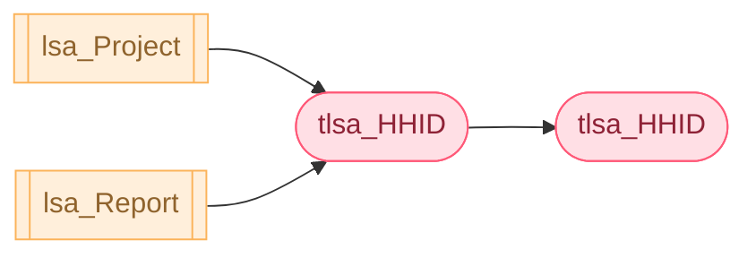
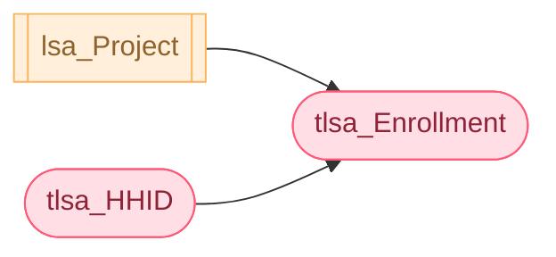
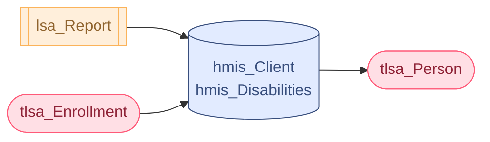
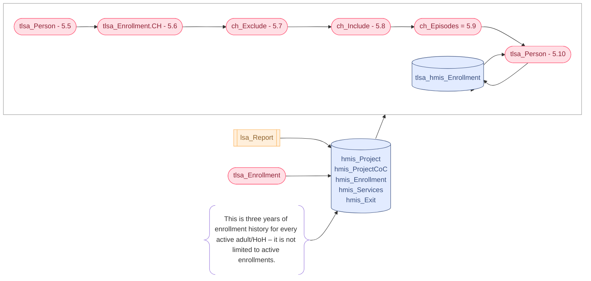
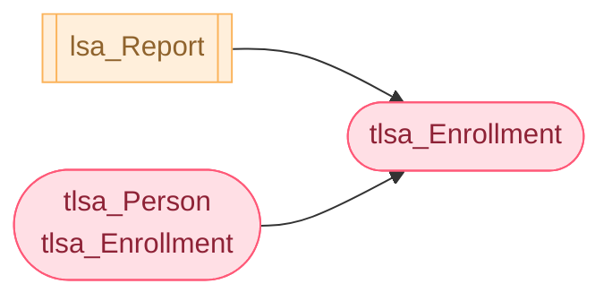
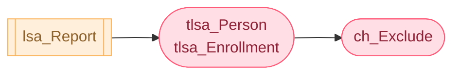

- Contents
{:toc}

# 5 - HMIS Business Logic - LSAPerson

# 5.1 Identify Active and Active in Residence (AIR) HouseholdIDs

This section defines the logic associated with identifying enrollments for heads of household that meet the criteria for inclusion in the active cohort.

It uses data in lsa_Report and lsa_Project as parameters applied to tlsa_HHID. As described, the **Active** column in tlsa_HHID is set to 1 for each active *HouseholdID*.

References to active **HouseholdID**s and/or any of the columns included in tlsa_HHID mean records where **Active** = 1 and the column values as they are set in this and subsequent steps.

## Source

| **lsa_Report**  |
|-----------------|
| ReportStart     |
| ReportEnd       |
| ReportCoC       |

| **lsa_Project** |
|-----------------|
| ProjectID       |

| **tlsa_HHID**   |
|-----------------|
| EnrollmentID    |
| LSAProjectType  |
| EntryDate       |
| MoveInDate      |
| ExitDate        |

## Target

| **tlsa_HHID** | **Column Description**                                                                                                                                             |
| ------------- | ------------------------------------------------------------------------------------------------------------------------------------------------------------------ |
| **Active**    | 1 identifies **HouseholdID**s included in the active cohort                                                                                                        |
| **AIR**       | 1 identifies the subset of **HouseholdID**s in the active cohort where the head of household’s enrollment includes at least one bed night during the report period |

## Logic

### Active

Set **Active** = 1 for tlsa_HHID.**HouseholdID**s where:
- There is a record for the **ProjectID** in lsa_Project; and
- **EntryDate** \<= <u>ReportEnd; and</u>
- **ExitDate** is NULL or **ExitDate** \>= <u>ReportStart</u>

### AIR

Set **AIR** = 1 for tlsa_HHID.**HouseholdID**s where:
- **Active** = 1; and:
- **ExitDate** \> <u>ReportStart</u> or **ExitDate** is NULL; and
- **LSAProjectType** in (0, 2,8); or
	  - **LSAProjectType** = 1 and **LastBedNight** between <u>ReportStart</u> and <u>ReportEnd</u>; or
	  - **LSAProjectType** in (3,13) and **MoveInDate** is not NULL

(Note: RRH-SO projects are considered non-residential and enrollments
are excluded from consideration.)

# 5.2 Identify Active and Active in Residence (AIR) Enrollments 

This section defines the logic associated with identifying all active enrollments associated with the active *HouseholdID*s identified in the previous step.

It uses data in lsa_Report and tlsa_HHID as parameters applied to tlsa_Enrollment and sets the **Active** column in tlsa_Enrollment to 1 for active enrollments.

References in subsequent sections to active enrollments and of the columns in tlsa_Enrollment mean the column values as they are set in this and subsequent steps.

## Source

| **tlsa_HHID**       |
|---------------------|
| HouseholdID         |
| Active              |

| **tlsa_Enrollment** |
|---------------------|
| EnrollmentID        |
| HouseholdID         |
| EntryDate           |
| MoveInDate          |
| ExitDate            |

## Target

| **tlsa_Enrollment** |
|---------------------|
| Active          |
| AIR           |

## Logic

### Active

**Active** = 1 is set to identify the subset of enrollments in tlsa_Enrollment where:
- The **HouseholdID** matches a **HouseholdID** in tlsa_HHID where  **Active** = 1; and
- **ExitDate** is NULL or **ExitDate** \>= <u>ReportStart</u>

### AIR

**AIR** = 1 is set to identify the subset of enrollments in tlsa_Enrollment where:

- The **HouseholdID** matches a **HouseholdID** in tlsa_HHID where **AIR** = 1; and
- **EntryDate** \<= <u>ReportEnd</u>; and
- **ExitDate** is NULL or **ExitDate** \> <u>ReportStart</u>; and
	- **LSAProjectType** in (0,2,8); or
	- **LSAProjectType** = 1 and **LastBedNight** between <u>ReportStart</u> and <u>ReportEnd</u>; or
	- **LSAProjectType** in (3,13), **MoveInDate** \<= <u>ReportEnd</u>

# 5.3 Get Active Clients for LSAPerson

The tlsa\_Person data construct holds one record for each distinct *PersonalID* in tlsa\_Enrollment where **Active** = 1. It is a client-level version of the aggregate LSAPerson data and is used to set values for each LSA reporting category – **RaceEthnicity**, **VetStatus**, etc. – for each client. It includes all columns from LSAPerson.csv other than **RowTotal** and **ReportID**, as well as several columns which are used as a reference to simplify business logic but do not correlate to a column in LSAPerson.

## Source

| tlsa_Enrollment |
|-----------------|
| PersonalID      |
| Active          |

## Target 

The logic associated with values for columns with names in **bold** below is described in this step. The business logic associated with other columns is described in subsequent steps.

| tlsa\_Person     | Column Description                                                                                                                                                                                                                                                                                                                                                                                                                                                                                                                                                                                                                                                                                                                                                                                                                                                                                                                                                                                                                                                                         |
| ---------------- | ------------------------------------------------------------------------------------------------------------------------------------------------------------------------------------------------------------------------------------------------------------------------------------------------------------------------------------------------------------------------------------------------------------------------------------------------------------------------------------------------------------------------------------------------------------------------------------------------------------------------------------------------------------------------------------------------------------------------------------------------------------------------------------------------------------------------------------------------------------------------------------------------------------------------------------------------------------------------------------------------------------------------------------------------------------------------------------------ |
| PersonalID       | Distinct **PersonalID**s tlsa\_Enrollment where **Active** = 1 The count of **PersonalID**s, grouped by the values in all other columns, is used to populate the **RowTotal** column of LSAPerson.                                                                                                                                                                                                                                                                                                                                                                                                                                                                                                                                                                                                                                                                                                                                                                                                                                                                                         |
| HoHAdult         | (Does not correlate to a column in LSAPerson.csv) Identifies whether the client was served as an adult, a head of household, or both for any active enrollment (0 = No, 1 = Adult, 2=HoH, 3 = Adult and HoH); used to simplify later steps. See section [5.4 LSAPerson Demographics](05 - LSAPerson.md#54-lsaperson-demographics)                                                                                                                                                                                                                                                                                                                                                                                                                                                                                                                                                                                                                                                                                                                                                                            |
| CHStart          | (Does not correlate to a column in LSAPerson.csv) Where **HoHAdult** > 0: \[**LastActive** – 3 years + 1 day\]; used to calculate **CHTime**. See section [5.5 Time Spent in ES/SH or on the Street – LSAPerson](05 - LSAPerson.md#55-time-spent-in-essh-or-on-the-street--lsaperson).                                                                                                                                                                                                                                                                                                                                                                                                                                                                                                                                                                                                                                                                                                                                                                                                                                                   |
| LastActive       | (Does not correlate to a column in LSAPerson.csv) Where **HoHAdult** > 0, the client’s last active date in the report period; used to calculate **CHTime.** See section [5.5 Time Spent in ES/SH or on the Street – LSAPerson](05 - LSAPerson.md#55-time-spent-in-essh-or-on-the-street--lsaperson).                                                                                                                                                                                                                                                                                                                                                                                                                                                                                                                                                                                                                                                                                                                                                                                                                                     |
| RaceEthnicity    | Race and Ethnicity all persons See section 5.4 LSAPerson Demographics                                                                                                                                                                                                                                                                                                                                                                                                                                                                                                                                                                                                                                                                                                                                                                                                                                                                                                                                                                                                                      |
| VetStatus        | Veteran Status for adults; not applicable (value = -1) for children See section 5.4 LSAPerson Demographics                                                                                                                                                                                                                                                                                                                                                                                                                                                                                                                                                                                                                                                                                                                                                                                                                                                                                                                                                                                 |
| DisabilityStatus | Disability Status for adults and heads of household based on records of _3.08 Disabling Condition_ for all active enrollments; not applicable (value = -1) for non-HoH children See section 5.4 LSAPerson Demographics                                                                                                                                                                                                                                                                                                                                                                                                                                                                                                                                                                                                                                                                                                                                                                                                                                                                     |
| CHTime           | For adults and heads of household, the total number of days in ES/SH or on the street in the three years prior to the client's last active date in the report period. Based on data from active and inactive enrollments, the count of days excludes any dates housed in continuum TH/RRH/PSH projects, but otherwise includes: -   Dates between entry and exit in continuum entry-exit ES and SH projects; and -   Bed-night dates in night-by-night shelters; and -   Dates between 3.917 _DateToStreetESSH_ and _EntryDate_ for ES/SH/TH/RRH/PSH projects; and -   Dates between any RRH/PSH _EntryDate_ and the earlier of _MoveInDate_ or _ExitDate_ when _LivingSituation_ is ES/SH/Street; or -   For people who do not meet the time criteria for chronic homelessness based on the above, may be set based on 3.917 number of months and number of times homeless in the past three years from ES/SH/TH/RRH/PSH enrollments with entry dates in the year ending on the client's last active date. See sections [5.5](#55-time-spent-in-essh-or-on-the-street--lsaperson)\-5.10 for associated business logic. |
| CHTimeStatus     | For clients with 365+ days of ES/SH/Street time in the three years prior to their last active date (**CHTime**), specifies whether the date ranges are consistent with the time criteria for chronic homelessness. Otherwise not applicable. See sections [5.5](#_ES/SH/Street_Time_–)\-5.10 for associated business logic.                                                                                                                                                                                                                                                                                                                                                                                                                                                                                                                                                                                                                                                                                                                                                                |
| DVStatus         | DV Status for adults and heads of household based on records of 4.11 Domestic Violence for all active enrollments; not applicable (value = -1) for non-HoH children See section 5.4 LSAPerson Demographics                                                                                                                                                                                                                                                                                                                                                                                                                                                                                                                                                                                                                                                                                                                                                                                                                                                                                 |
| ESTAgeMin        | The person’s minimum age at the later of ReportStart and _EntryDate_ for any active ES/SH/TH enrollment.                                                                                                                                                                                                                                                                                                                                                                                                                                                                                                                                                                                                                                                                                                                                                                                                                                                                                                                                                                                   |
| ESTAgeMax        | The person’s maximum age at the later of ReportStart and _EntryDate_ for any active ES/SH/TH enrollment.                                                                                                                                                                                                                                                                                                                                                                                                                                                                                                                                                                                                                                                                                                                                                                                                                                                                                                                                                                                   |
| HHTypeEST        | Household type(s) for active ES/SH/TH enrollments.                                                                                                                                                                                                                                                                                                                                                                                                                                                                                                                                                                                                                                                                                                                                                                                                                                                                                                                                                                                                                                         |
| HoHEST           | Household type(s) for active ES/SH/TH enrollments as a head of household                                                                                                                                                                                                                                                                                                                                                                                                                                                                                                                                                                                                                                                                                                                                                                                                                                                                                                                                                                                                                   |
| AdultEST         | Household type(s) for active enrollments in ES/SH/TH projects as an adult.                                                                                                                                                                                                                                                                                                                                                                                                                                                                                                                                                                                                                                                                                                                                                                                                                                                                                                                                                                                                                 |
| AIRAdultEST      | Household type(s) in which adults had at least one ES/SH/TH bed night in the report period.                                                                                                                                                                                                                                                                                                                                                                                                                                                                                                                                                                                                                                                                                                                                                                                                                                                                                                                                                                                                |
| HHChronicEST     | Population identifier; household type(s) in which the person was served in ES/SH/TH projects in household with a chronically homeless adult or HoH.                                                                                                                                                                                                                                                                                                                                                                                                                                                                                                                                                                                                                                                                                                                                                                                                                                                                                                                                        |
| HHVetEST         | Population identifier; household type(s) in which the person was served in ES/SH/TH projects in household with a veteran.                                                                                                                                                                                                                                                                                                                                                                                                                                                                                                                                                                                                                                                                                                                                                                                                                                                                                                                                                                  |
| HHDisabilityEST  | Population identifier; household type(s) in which the person was served in ES/SH/TH projects in household with a disabled adult or HoH.                                                                                                                                                                                                                                                                                                                                                                                                                                                                                                                                                                                                                                                                                                                                                                                                                                                                                                                                                    |
| HHFleeingDVEST   | Population identifier; household type(s) in which the person was served in ES/SH/TH projects in household with an adult or HoH fleeing domestic violence.                                                                                                                                                                                                                                                                                                                                                                                                                                                                                                                                                                                                                                                                                                                                                                                                                                                                                                                                  |
| HHAdultAgeAOEST  | Population identifier based on the combination of adult household members’ ages for ES/SH/TH clients served in AO households.                                                                                                                                                                                                                                                                                                                                                                                                                                                                                                                                                                                                                                                                                                                                                                                                                                                                                                                                                              |
| HHAdultAgeACEST  | Population identifier based on the combination of adult household members’ ages for ES/SH/TH clients served in AC households.                                                                                                                                                                                                                                                                                                                                                                                                                                                                                                                                                                                                                                                                                                                                                                                                                                                                                                                                                              |
| HHParentEST      | Population identifier; household type(s) in which the person was served in ES/SH/TH projects in a household that includes at least one member whose RelationshipToHoH is 'Child'.                                                                                                                                                                                                                                                                                                                                                                                                                                                                                                                                                                                                                                                                                                                                                                                                                                                                                                          |
| AC3PlusEST       | Population identifier; indicates whether or not the person was served in ES/SH/TH projects in an AC household with 3 or more household members under 18.                                                                                                                                                                                                                                                                                                                                                                                                                                                                                                                                                                                                                                                                                                                                                                                                                                                                                                                                   |
| AIREST           | Household type(s) for enrollments with at least one bed night in the report period for ES/SH/TH.                                                                                                                                                                                                                                                                                                                                                                                                                                                                                                                                                                                                                                                                                                                                                                                                                                                                                                                                                                                           |
| AIRHoHEST        | Household type(s) for enrollments with at least one bed night in the report period for ES/SH/TH as head of household.                                                                                                                                                                                                                                                                                                                                                                                                                                                                                                                                                                                                                                                                                                                                                                                                                                                                                                                                                                      |
| RRHAgeMin        | The person’s minimum age at the later of ReportStart and _EntryDate_ for any active RRH enrollment.                                                                                                                                                                                                                                                                                                                                                                                                                                                                                                                                                                                                                                                                                                                                                                                                                                                                                                                                                                                        |
| RRHAgeMax        | The person’s maximum age at the later of ReportStart and _EntryDate_ for any active RRH enrollment.                                                                                                                                                                                                                                                                                                                                                                                                                                                                                                                                                                                                                                                                                                                                                                                                                                                                                                                                                                                        |
| HHTypeRRH        | Household type(s) in which the person was served in an RRH project.                                                                                                                                                                                                                                                                                                                                                                                                                                                                                                                                                                                                                                                                                                                                                                                                                                                                                                                                                                                                                        |
| HoHRRH           | Household type(s) in which the person was served in an RRH project as a head of household                                                                                                                                                                                                                                                                                                                                                                                                                                                                                                                                                                                                                                                                                                                                                                                                                                                                                                                                                                                                  |
| AdultRRH         | Household type(s) for active enrollments in RRH projects as an adult.                                                                                                                                                                                                                                                                                                                                                                                                                                                                                                                                                                                                                                                                                                                                                                                                                                                                                                                                                                                                                      |
| AIRAdultRRH      | Household type(s) in which adults had at least one RRH bed night in the report period.                                                                                                                                                                                                                                                                                                                                                                                                                                                                                                                                                                                                                                                                                                                                                                                                                                                                                                                                                                                                     |
| HHChronicRRH     | Population identifier; household type(s) in which the person was served an RRH project in household with a chronically homeless adult or HoH.                                                                                                                                                                                                                                                                                                                                                                                                                                                                                                                                                                                                                                                                                                                                                                                                                                                                                                                                              |
| HHVetRRH         | Population identifier; household type(s) in which the person was served an RRH project in household with a veteran.                                                                                                                                                                                                                                                                                                                                                                                                                                                                                                                                                                                                                                                                                                                                                                                                                                                                                                                                                                        |
| HHDisabilityRRH  | Population identifier; household type(s) in which the person was served an RRH project in household with a disabled adult or HoH.                                                                                                                                                                                                                                                                                                                                                                                                                                                                                                                                                                                                                                                                                                                                                                                                                                                                                                                                                          |
| HHFleeingDVRRH   | Population identifier; household type(s) in which the person was served an RRH project in household with an adult or HoH fleeing domestic violence.                                                                                                                                                                                                                                                                                                                                                                                                                                                                                                                                                                                                                                                                                                                                                                                                                                                                                                                                        |
| HHAdultAgeAORRH  | Population identifier based on the combination of adult household members’ ages for RRH clients served in AO households.                                                                                                                                                                                                                                                                                                                                                                                                                                                                                                                                                                                                                                                                                                                                                                                                                                                                                                                                                                   |
| HHAdultAgeACRRH  | Population identifier based on the combination of adult household members’ ages for RRH clients served in AO households.                                                                                                                                                                                                                                                                                                                                                                                                                                                                                                                                                                                                                                                                                                                                                                                                                                                                                                                                                                   |
| HHParentRRH      | Population identifier; household type(s) in which the person was served an RRH project in a household that includes at least one member whose RelationshipToHoH is 'Child'.                                                                                                                                                                                                                                                                                                                                                                                                                                                                                                                                                                                                                                                                                                                                                                                                                                                                                                                |
| AC3PlusRRH       | Population identifier; indicates whether or not the person was served an RRH project in an AC household with 3 or more household members under 18.                                                                                                                                                                                                                                                                                                                                                                                                                                                                                                                                                                                                                                                                                                                                                                                                                                                                                                                                         |
| AIRRRH           | Household type(s) for enrollments with at least one bed night in the report period for RRH.                                                                                                                                                                                                                                                                                                                                                                                                                                                                                                                                                                                                                                                                                                                                                                                                                                                                                                                                                                                                |
| AIRHoHRRH        | Household type(s) for enrollments with at least one bed night in the report period for RRH as head of household.                                                                                                                                                                                                                                                                                                                                                                                                                                                                                                                                                                                                                                                                                                                                                                                                                                                                                                                                                                           |
| PSHAgeMin        | The person’s minimum age at the later of ReportStart and _EntryDate_ for any active PSH enrollment.                                                                                                                                                                                                                                                                                                                                                                                                                                                                                                                                                                                                                                                                                                                                                                                                                                                                                                                                                                                        |
| PSHAgeMax        | The person’s maximum age at the later of ReportStart and _EntryDate_ for any active PSH enrollment.                                                                                                                                                                                                                                                                                                                                                                                                                                                                                                                                                                                                                                                                                                                                                                                                                                                                                                                                                                                        |
| HHTypePSH        | Household type(s) for PSH enrollments.                                                                                                                                                                                                                                                                                                                                                                                                                                                                                                                                                                                                                                                                                                                                                                                                                                                                                                                                                                                                                                                     |
| HoHPSH           | Household type(s) in which the person was served in an PSH project as a head of household                                                                                                                                                                                                                                                                                                                                                                                                                                                                                                                                                                                                                                                                                                                                                                                                                                                                                                                                                                                                  |
| AdultPSH         | Household type(s) for active enrollments in PSH projects as an adult.                                                                                                                                                                                                                                                                                                                                                                                                                                                                                                                                                                                                                                                                                                                                                                                                                                                                                                                                                                                                                      |
| AIRAdultPSH      | Household type(s) in which adults had at least one PSH bed night in the report period.                                                                                                                                                                                                                                                                                                                                                                                                                                                                                                                                                                                                                                                                                                                                                                                                                                                                                                                                                                                                     |
| HHChronicPSH     | Population identifier; household type(s) in which the person was served an PSH project in household with a chronically homeless adult or HoH.                                                                                                                                                                                                                                                                                                                                                                                                                                                                                                                                                                                                                                                                                                                                                                                                                                                                                                                                              |
| HHVetPSH         | Population identifier; household type(s) in which the person was served an PSH project in household with a veteran.                                                                                                                                                                                                                                                                                                                                                                                                                                                                                                                                                                                                                                                                                                                                                                                                                                                                                                                                                                        |
| HHDisabilityPSH  | Population identifier; household type(s) in which the person was served an PSH project in household with a disabled adult or HoH.                                                                                                                                                                                                                                                                                                                                                                                                                                                                                                                                                                                                                                                                                                                                                                                                                                                                                                                                                          |
| HHFleeingDVPSH   | Population identifier; household type(s) in which the person was served an PSH project in household with an adult or HoH fleeing domestic violence.                                                                                                                                                                                                                                                                                                                                                                                                                                                                                                                                                                                                                                                                                                                                                                                                                                                                                                                                        |
| HHAdultAgeAOPSH  | Population identifier based on the combination of adult household members’ ages for PSH clients served in AO households.                                                                                                                                                                                                                                                                                                                                                                                                                                                                                                                                                                                                                                                                                                                                                                                                                                                                                                                                                                   |
| HHAdultAgeACPSH  | Population identifier based on the combination of adult household members’ ages for PSH clients served in AO households.                                                                                                                                                                                                                                                                                                                                                                                                                                                                                                                                                                                                                                                                                                                                                                                                                                                                                                                                                                   |
| HHParentPSH      | Population identifier; household type(s) in which the person was served an PSH project in a household that includes at least one member whose RelationshipToHoH is 'Child'.                                                                                                                                                                                                                                                                                                                                                                                                                                                                                                                                                                                                                                                                                                                                                                                                                                                                                                                |
| AC3PlusPSH       | Population identifier; indicates whether or not the person was served an PSH project in an AC household with 3 or more household members under 18.                                                                                                                                                                                                                                                                                                                                                                                                                                                                                                                                                                                                                                                                                                                                                                                                                                                                                                                                         |
| AIRPSH           | Household type(s) for enrollments with at least one bed night in the report period for PSH.                                                                                                                                                                                                                                                                                                                                                                                                                                                                                                                                                                                                                                                                                                                                                                                                                                                                                                                                                                                                |
| AIRHoHPSH        | Household type(s) for enrollments with at least one bed night in the report period for PSH as head of household.                                                                                                                                                                                                                                                                                                                                                                                                                                                                                                                                                                                                                                                                                                                                                                                                                                                                                                                                                                           |
| RRHSOAgeMin      | The minimum age at the later of ReportStart and EntryDate for any RRH-SO enrollment.                                                                                                                                                                                                                                                                                                                                                                                                                                                                                                                                                                                                                                                                                                                                                                                                                                                                                                                                                                                                       |
| RRHSOAgeMax      | The maximum age at the later of ReportStart and EntryDate for any RRH-SO enrollment.                                                                                                                                                                                                                                                                                                                                                                                                                                                                                                                                                                                                                                                                                                                                                                                                                                                                                                                                                                                                       |
| HHTypeRRHSONoMI  | Household type(s) for active enrollments in RRH-SO projects with no move-in date                                                                                                                                                                                                                                                                                                                                                                                                                                                                                                                                                                                                                                                                                                                                                                                                                                                                                                                                                                                                           |
| HHTypeRRHSOMI    | Household type(s) for active enrollments in RRH-SO projects with a move-in date                                                                                                                                                                                                                                                                                                                                                                                                                                                                                                                                                                                                                                                                                                                                                                                                                                                                                                                                                                                                            |
| HHTypeES         | Household type(s) for active enrollments in ES projects.                                                                                                                                                                                                                                                                                                                                                                                                                                                                                                                                                                                                                                                                                                                                                                                                                                                                                                                                                                                                                                   |
| HHTypeSH         | Household type(s) for active enrollments in SH projects.                                                                                                                                                                                                                                                                                                                                                                                                                                                                                                                                                                                                                                                                                                                                                                                                                                                                                                                                                                                                                                   |
| HHTypeTH         | Household type(s) for active enrollments in TH projects.                                                                                                                                                                                                                                                                                                                                                                                                                                                                                                                                                                                                                                                                                                                                                                                                                                                                                                                                                                                                                                   |
| HIV              | Population identifier for adults with HIV or AIDS and active in residence during the report period                                                                                                                                                                                                                                                                                                                                                                                                                                                                                                                                                                                                                                                                                                                                                                                                                                                                                                                                                                                         |
| SMI              | Population identifier for adults with Serious Mental Illness and active in residence during the report period                                                                                                                                                                                                                                                                                                                                                                                                                                                                                                                                                                                                                                                                                                                                                                                                                                                                                                                                                                              |
| SUD              | Population identifier for adults with a substance use disorder and active in residence during the report period                                                                                                                                                                                                                                                                                                                                                                                                                                                                                                                                                                                                                                                                                                                                                                                                                                                                                                                                                                            |
| SSNValid         | Used for data quality reporting in LSAReport; see [11.6 Data Quality: SSN Issues](11 - LSAReport.md#116-data-quality-ssn-issues).                                                                                                                                                                                                                                                                                                                                                                                                                                                                                                                                                                                                                                                                                                                                                                                                                                                                                                                                                                                                        |

## Logic

LSAPerson is the source for demographic reporting produced by the HDX 2.0. Every active client is counted in a single row of LSAPerson. Counts in **RowTotal** are grouped by the values in all other columns. The sum of **RowTotal** values is the total number of clients in the active cohort.

In the intermediate client-level tlsa\_Person, each active client is represented by a single row with *PersonalID* as the primary key.

# 5.4 LSAPerson Demographics

This step defines the logic associated with LSA reporting on personal characteristics – broadly referred to as demographics – for each active adult/head of household in tlsa\_Person.

It uses data in lsa\_Report and active tlsa\_Enrollment records as parameters applied to hmis\_Client. These data are used to set LSA reporting category values in tlsa\_Person.
## Source

| **lsa_Report**        |
|-----------------------|
| ReportStart           |

| **tlsa_Enrollment**   |
|-----------------|
| PersonalID            |
| RelationshipToHoH     |
| ActiveAge             |
| Disability Status     |
| DVStatus              |

| **hmis_Client**       |
|-----------------|
| PersonalID            |
| AmIndAKNative         |
| Asian                 |
| BlackAfAmerican       |
| HispanicLatinao       |
| MidEastNAfrican       |
| NativeHIPacific       |
| White                 |
| RaceNone              |
| VeteranStatus         |

| **hmis_Disabilities** |
|-----------------|
| EnrollmentID          |
| InformationDate       |
| DisabilityType        |
| DisabilityResponse    |
| IndefiniteAndImpairs  |

## Target

| tlsa_Person      |
|------------------|
| HoHAdult         |
| RaceEthnicity    |
| VetStatus        |
| DisabilityStatus |
| DVStatus         |
| HIV              |
| SMI              |
| SUD              |

## Logic

### HoHAdult

**HoHAdult** is used to indicate whether the client was served as an adult, a head of household, or both adult and HoH. Children and people of unknown age who were not served as heads of household are included in reporting on age and in population counts of people, but are not included in other demographic counts. There is no parallel **HoHAdult** column in the LSAPerson file, but it is useful in identifying which columns/records to update.

| Value | Category         |
|-------|------------------|
| 0     | Not HoH or Adult |
| 1     | Adult            |
| 2     | HoH              |
| 3     | Adult and HoH    |

### RaceEthnicity

-   If *RaceNone* is equal to 8 or 9, regardless of any other data, set **RaceEthnicity** = 98.
-   If *RaceNone* is equal to 99, regardless of any other data, set **RaceEthnicity** = 99.
-   If any of the columns listed below have a value of 1, set **RaceEthnicity** to the unique combination of associated LSA values in numeric order. For example, if *Asian* = 1 and *White* = 1, set **RaceEthnicity** to 25.

| HMIS CSV Column | LSA Value |
|-----------------|-----------|
| AmIndAKNative   | 1         |
| Asian           | 2         |
| BlackAfAmerican | 3         |
| HispanicLatinao | 6         |
| MidEastNAfrican | 7         |
| NativeHIPacific | 4         |
| White           | 5         |

If none of the above apply (i.e., if none of the columns listed are set to 1), set **RaceEthnicity** = 99.

### VetStatus

Assign a value of -1 for all clients under 18 or of unknown age (**HoHAdult** \= in (0,2)).

Crosswalk HMIS *VeteranStatus* values for adults as follows:

| HMIS Value | HMIS Category | LSA Value | LSA Category |
|----|----|----|----|
| 0 | No | 0 | Not a veteran |
| 1 | Yes | 1 | Veteran |
| 8 | Client doesn’t know | 98 | Data not provided by client |
| 9 | Client prefers not to answer | 98 | Data not provided by client |
| (any other) | Any other, including NULL | 99 | Data missing or invalid |

### HIV

Set **HIV** = -1 for:

-   People not sheltered during the report period (i.e., those with no records in tlsa\_Enrollment where **AIR** = 1); and
-   People under 18.

For any person with at least one enrollment where tlsa\_Enrollment.**AIR** = 1, set **HIV** = 1 if one or more of those enrollments has an associated hmis\_Disabilities record where:

-   *InformationDate* <= <u>ReportEnd</u>
-   *DisabilityType* = 8
-   *DisabilityResponse* = 1

Set **HIV** = 0 for all other adults.

### SMI

Set **SMI** = -1 for:

-   People not sheltered during the report period (i.e., those with no records in tlsa\_Enrollment where **AIR** = 1); and
-   People under 18.

For any person with at least one enrollment where tlsa\_Enrollment.**AIR** = 1, set **SMI** = 1 if one or more of those enrollments has an associated hmis\_Disabilities record where:

-   *InformationDate* <= <u>ReportEnd</u>
-   *DisabilityType* = 9
-   *DisabilityResponse* = 1
-   *IndefiniteAndImpairs* = 1

Set **SMI** = 0 for all other adults.

### SUD

Set **SUD** = -1 for:

-   People not sheltered during the report period (i.e., those with no records in tlsa\_Enrollment where **AIR** = 1); and
-   People under 18.

For any person with at least one enrollment where tlsa\_Enrollment.**AIR** = 1, set **SUD** = 1 if one or more of those enrollments has an associated hmis\_Disabilities record where:

-   *InformationDate* <= <u>ReportEnd</u>
-   *DisabilityType* = 10
-   *DisabilityResponse* is 1 (Alcohol use disorder), 2 (Drug use disorder), or 3 (Both alcohol and drug use disorders)
-   *IndefiniteAndImpairs* = 1

Set **SUD** = 0 for all other adults.

### DisabilityStatus

Assign a value of -1 for all non-heads of household under 18 or of unknown age (**HoHAdult** \= 0).

*DisablingCondition* is an enrollment-level data element in HMIS, but is reported as a person-level characteristic in the LSA. Set the value of tlsa\_Person.**DisabilityStatus** to the first LSA Value in the table below where tlsa\_Enrollment.**DisabilityStatus** for any active enrollment matches.

| Priority | Criteria                                 | tlsa_Person.DisabilityStatus |
| -------- | ---------------------------------------- | ---------------------------- |
| 1        | tlsa_Enrollment.**DisabilityStatus** = 1 | 1 (Disabled)                 |
| 2        | tlsa_Person.**HIV** = 1                  | 1 (Disabled)                 |
| 2        | tlsa_Person.**SMI** = 1                  | 1 (Disabled)                 |
| 2        | tlsa_Person.**SUD** = 1                  | 1 (Disabled)                 |
| 3        | tlsa_Enrollment.**DisabilityStatus** = 0 | 0                            |
| 4        | (Any other)                              | 99                           |

### DVStatus

Assign a value of -1 for all non-heads of household under 18 or of unknown age (**HoHAdult** \= 0).

*DomesticViolenceSurvivor* is an enrollment-level data element in HMIS but is reported as a person-level characteristic in the LSA. Set the value of of tlsa\_Person.**DVStatus** to the first LSA Value in the table below where tlsa\_Enrollment.**DVStatus** for any active enrollment matches.

| Priority | tlsa_Enrollment.DVStatus | tlsa_Person.DVStatus | LSA Category |
|----|----|----|----|
| 1 | 1 | 1 | DV survivor, currently fleeing |
| 2 | 2 | 2 | DV survivor, not currently fleeing |
| 3 | 3 | 3 | DV survivor, unknown if currently fleeing |
| 4 | 10 | 0 | No history of DV reported |
| 5 | 98 | 98 | Data not provided |
| 6 | NULL | 99 | Missing/invalid |

# 5.5 Time Spent in ES/SH or on the Street – LSAPerson

The definition of *chronically homeless* specifies the total length of time spent either in a place not meant for human habitation, a safe haven, or in an emergency shelter relevant to chronic homelessness in months: “continuously for at least 12 months” or on four or more occasions for a total of “at least 12 months“ within a timeframe of 3 years.

Specific to the LSA:

- All time related to chronic homelessness is counted in days, i.e.,
  “continuously for at least <u>365 days</u>” or “in four or more
  episodes for a total of at least <u>365 days</u>*”*;
- The three-year timeframe for any given client ends on their last
  active date in the report period, i.e., it is specific to the client;
  and
- The count of days is based on a combination of *3.917(A or B) Living
  Situation* data and entry/exit dates for enrollments in
  HMIS-participating ES/SH/TH/RRH/PSH projects.

Although a person must have a disabling condition in order to be considered chronically homeless, the LSA includes reporting on time spent in places not meant for habitation, safe haven, and/or emergency shelter for all heads of household and adults, regardless of the value in **DisabilityStatus**. It is based on constructing a timeline of activity for each person in tlsa\_Person based on HMIS enrollment data in the three years ending on the client’s most recent active date in the report period. This will include active enrollments and, for people with relevant enrollments prior to the report period, inactive enrollments.

The relevant columns in LSAPerson – and in tlsa\_Person – are **CHTime** and **CHTimeStatus**. Because of the complexity, the business logic is broken out into five separate steps defined beginning with this section (5.5) and concluding with [section 5.10](#510-chtime-and-chtimestatus--lsaperson). Section numbers associated with each step are shown below in the graphic for the relevant data construct.

This section defines how to identify the start (**CHStart**) and end (**LastActive**) dates for the three-year period for each adult/HoH in tlsa\_Person based on report parameters in lsa\_Report.

Section 5.6 describes which HMIS enrollments active in that three-year period are relevant. This includes but is not limited to active enrollments for clients with relevant activity prior to the report period. As described, these are identified in tlsa\_Enrollment by setting **CH** = 1.

Section 5.7 defines the logic for establishing, for each adult/HoH in tlsa\_Person, a list of dates on which TH/RRH/PSH enrollment data indicates that the client was NOT on the street or in ES/SH. As described, records of individual dates are inserted to ch\_Exclude.

Section 5.8 specifies how to build, for each adult/HoH in tlsa\_Person, a list of ES/SH/Street dates based on ch\_Enrollment in conjunction with ch\_Exclude. As described, records of individual dates are inserted to ch\_Include.

Section 5.9 describes the business logic associated with identifying ‘occasions’ or an ‘episodes’ – and the length in days for each – given a list of ES/SH/Street dates for a person. As described, this is accomplished by creating records of episodes in ch\_Episode with start and end dates based on ch\_Exclude.

Finally, Section 5.10 describes how to set LSA reporting category values in tlsa\_Person for **CHTime** and **CHTimeStatus** based on a list of episodes with start and end dates (ch\_Episodes) and, for any adult/HoH who does not meet the time-based criteria for chronic homelessness and is missing relevant *3.917 Living Situation* data, update the initial values to reflect missing data.

## Source

| **lsa_Report**      |
|---------------------|
| ReportEnd           |

| **tlsa_Enrollment** |
|---------------------|
| EnrollmentID        |
| PersonalID          |
| ExitDate            |
| LastBedNight        |

| **tlsa_Person**     |
|---------------------|
| HoHAdult            |

## Target 

| **tlsa_Person** |
|-----------------|
| **CHStart**     |
| **LastActive**  |

## Logic

The three-year timeframe for each head of household/adult – the CH date range – is identified in tlsa\_Person with dates in the **CHStart** and **LastActive** columns.

The last active date for any given enrollment is:

-   For a night-by-night shelter, the earlier of <u>ReportEnd</u> or \[**LastBedNight** + 1 day\]; and
-   For any other project type, the first non-NULL of **ExitDate** and <u>ReportEnd</u>.

**LastActive** for each record in tlsa\_Person where **HoHAdult** > 0 is the latest active date based on all enrollments.

**CHStart** is (**LastActive** – 3 years) + 1 day.

# 5.6 Enrollments Relevant to Counting ES/SH/Street Dates

## Source

| **lsa_Report**      |
|---------------------|
| ReportEnd           |
| ReportCoC           |

| **tlsa_Person**     |
|---------------------|
| PersonalID          |
| HoHAdult            |
| CHStart             |
| LastActive          |

| **tlsa_Enrollment** |
|---------------------|
| EntryDate           |
| ExitDate            |

## Target 

| **tlsa_Enrollment** |
|---------------------|
| **CH**              |

## Logic

Enrollments relevant to determining whether or not a person meets the time criteria for chronic homelessness include active and inactive enrollments from tlsa\_Enrollment where:

-   tlsa\_Person.**HoHAdult** \> 0 (chronic homelessness is only reported for adults and heads of household)
-   **PersonalID** \= tlsa\_Person.**PersonalID**
-   **EntryDate** <= **LastActive**
-   **ExitDate** is NULL or **ExitDate** > **CHStart**

# 5.7 Get Dates to Exclude from Counts of ES/SH/Street Days (ch_Exclude)

## Source

| **lsa_Report**     |
|---------------------|
| ReportStart        |
| ReportEnd          |

| **tlsa_Person**     |
|---------------------|
| CHStart             |
| LastActive          |

| **tlsa_Enrollment** |
|---------------------|
| PersonalID          |
| LSAProjectType      |
| EntryDate           |
| MoveInDate          |
| ExitDate            |
| CH                  |

## Target

| **ch_Exclude** | **Column Description** |
|----|----|
| **PersonalID** | **PersonalD** |
| **ExcludeDate** | Distinct dates between **CHStart** and **LastActive** when client was either in TH or housed in RRH/PSH. |

## Logic

Any date on which a client was either in TH or housed in RRH/PSH – i.e., known to be in a place other than one not meant for human habitation, a safe haven, or in an emergency shelter – is generally excluded from the count of ES/SH/Street days, even if there is conflicting information – e.g., an ES enrollment active on the date. The only exception to this is for stays of less than seven days, and only if the dates fall between two dates less than seven days apart on which the client is otherwise documented as being on the street or in ES/SH.

To resolve potential data conflicts, dates on which a client is enrolled in TH or housed in RRH/PSH are excluded when identifying ES/SH/Street days based on ES/SH enrollment dates, bed nights, and *3.917 Prior Living Situation* data. For dates between **CHStart** and **LastActive:**

-   For any CH enrollment where **MoveInDate** is not NULL, all dates between **MoveInDate** and the earlier of (**ExitDate** – 1 day) or <u>ReportEnd</u> are excluded.
-   For any CH enrollment where **LSAProjectType** *\=* 2 (TH), all dates between **EntryDate** and the earlier of (**ExitDate** – 1 day) or <u>ReportEnd</u> are excluded.
# 5.8 Get Dates to Include in Counts of ES/SH/Street Days (ch_Include)

## Source

| **tlsa_Person**                                          |
|----------------------------------------------------------|
| PersonalID                                               |
| CHStart                                                  |
| LastActive                                               |

| **tlsa_Enrollment**                                      |
|---------------------|
| CH                                                       |
| PersonalID                                               |
| EnrollmentID                                             |
| LSAProjectType                                           |
| EntryDate                                                |
| MoveInDate                                               |
| ExitDate                                                 |

| **hmis_Enrollment**                                      |
|---------------------|
| EnrollmentID                                             |
| LivingSituation                                          |
| LengthOfStay                                             |
| PreviousStreetESSH                                       |
| DateToStreetESSH                                         |

| **hmis_Services**                                        |
|---------------------|
| EnrollmentID                                             |
| *BedNightDate* (*DateProvided* where *RecordType* = 200) |

## Target

| **ch_Include** | **Column Description** |
|----|----|
| **PersonalID** | **PersonalD** |
| **ESSHStreetDate** | Distinct dates between **CHStart** and **LastActive** when client was in ES/SH or on the street; also referred to as ES/SH/Street dates. |

## Logic

For each **PersonalID** in tlsa\_Person, any date between **CHStart** and **LastActive** is counted as an **ESSHStreetDate** based on HMIS data if:

-   The date is not excluded because the client was enrolled in a TH project or enrolled and housed in an RRH/PSH project (ch\_Exclude.**ExcludeDate**); and
-   The date is consistent with any set of criteria listed below based on tlsa\_Enrollments where **CH** = 1.

### Enrollment in Entry/Exit ES or SH

- **LSAProjectType** in (0,8); and
- ESSHStreetDate \>= (later of EntryDate and CHStart)*;* and
- **ESSHStreetDate** \< (earliest non-NULL value for **ExitDate** or
  \[**LastActive** + 1 day\])

### Bed Nights in Night-by-Night ES 

- **LSAProjectType** = 1; and
- **ESSHStreetDate** = *BedNightDate*
- *BedNightDate* \>= LookbackDate
- *BedNightDate* \>= **EntryDate** for the associated enrollment
- tlsa_Enrollment.**ExitDate** is NULL or *BedNightDate* \<
  tlsa_Enrollment.**ExitDate**

### ES/SH/Street Dates from 3.917 Living Situation

For enrollments where **EntryDate** > **CHStart**, dates on which the client was on the street on in ES/SH based on 3.917 are included as **ESSHStreetDate**s if they have not already been excluded or included based on prior criteria.

-   An **ESSHStreetDate** is counted for ES and SH projects (**LSAProjectType** in (0,1,8)) if:
	-   *LivingSituation* in (101,118,116); and
	-   **ESSHStreetDate** >= *DateToStreetESSH* and < **EntryDate.**
-   For TH, PSH, and RRH projects (**LSAProjectType** in (2,3,13,15)), **ESSHStreetDate**s based on 3.917 are only counted if:
	-   The client was in ES/SH or on the street prior to entry:
	-   *LivingSituation* in (101,118,116); or
	-   *LengthOfStay* in (10, 11) and *PreviousStreetESSH* = 1; or
	-   *LivingSituation* in (204,205,206,207,215,225) and *LengthOfStay* in (2,3) and *PreviousStreetESSH* = 1
-   **ESSHStreetDate** >= *DateToStreetESSH*; and
    -   **LSAProjectType** = 2 and **ESSHStreetDate** < EntryDate; or
    -   **LSAProjectType** in (3,13,15) and
        -   **ESSHStreetDate** < MoveInDate; or
        -   **MoveInDate** is NULL and **ESSHStreetDate** < **ExitDate**; or
        -   **MoveInDate** is NULL and **ExitDate** is NULL and **ESSHStreetDate** <= **LastActive**

### Gaps of Less than Seven Days Between Two ES/SH/Street Dates

Any date that falls between two ES/SH/Street dates that have been identified using the criteria above and are less than 7 days apart is counted as a ES/SH/Street day.
- \[Date\] \> \[**ESSHStreetDate***1*\]*;* and
- \[Date\] \< \[**ESSHStreetDate***2*\]; and
- (\[**ESSHStreetDate***1*\] + 7 days) \>= \[**ESSHStreetDate***2*\]

For example, if a client has *BedNightDate*s on June 1 and June 5 of the same year, the 3 dates between – June 2, 3, and 4 – are also counted as ES/SH/Street dates.

Note that gaps of less than 7 days between **ESSHStreetDate**s are counted as ES/SH/Street dates regardless of ch\_Exclude dates.

# 5.9 Get ES/SH/Street Episodes (ch_Episodes)

## Source

| **ch_Include** |
|----------------|
| PersonalID     |
| ESSHStreetDate |

## Target

| ch_Episodes | Column Description |
|----|----|
| PersonalID | tlsa_Person |
| episodeStart | The first ES/SH/Street date in the series. |
| episodeEnd | The last ES/SH/Street date in the series. |
| episodeDays | The number of days between **episodeStart** and **episodeEnd.** |

## Logic

For purposes of the LSA, an ‘episode’ is a continuous – i.e., uninterrupted by any period of seven or more contiguous days — series of ES/SH/Street dates.

Each record in ch\_Episodes represents an uninterrupted series of ES/SH/Street dates identified in the previous step. Based on ch\_Include for each HoH/adult in tlsa\_Person:

-   **episodeStart** is any **ESSHStreetDate** where there is no (**ESSHStreetDate** – 1 day) for the same *PersonalID* – i.e., any ES/SH/Street date where there is no information to indicate that the client was in ES/SH or on the street on the day before.
-   **episodeEnd** is the first **ESSHStreetDate** after **episodeStart** where (**ESSHStreetDate** + 1 day) does not exist
-   **episodeDays** is the \[number of days between **episodeStart** and **episodeEnd**\] + 1 day

# 5.10 CHTime and CHTimeStatus – LSAPerson

## Source

| **tlsa_Person**              |
|------------------------------|
| PersonalID                   |
| HoHAdult                     |

| **ch_Episodes**              |
|------------------------------|
| PersonalID                   |
| episodeStart                 |
| episodeEnd                   |
| episodeDays                  |

| **tlsa_Enrollment**          |
|------------------------------|
| EnrollmentID                 |
| CH                           |
| PersonalID                   |
| LSAProjectType               |

| **hmis_Enrollment**          |
|------------------------------|
| PersonalID                   |
| EntryDate                    |
| LivingSituation              |
| LengthOfStay                 |
| DateToStreetESSH             |
| TimesHomelessPastThreeYears  |
| MonthsHomelessPastThreeYears |

## Target

| tlsa_Person  |
|--------------|
| CHTime       |
| CHTimeStatus |

## Logic

There are a total of ten valid combinations of **CHTime** and **CHTimeStatus** values. They are summarized in the table below; detailed logic follows.

| Priority | CHTime | CHTimeStatus | Category |
|:--:|:--:|:--:|----|
| 1 | -1 | -1 | n/a – tlsa_Person.**HoHAdult** = 0 |
| 2 | 365 | 1 | Client has a ch_Episode where **episodeDays** \>= 365 with an **episodeEnd** in the year ending on **LastActive** |
| 3 | 365 | 2 | Client has 4 or more episodes and the sum of **episodeDays** for all ch_Episodes is \>= 365. |
| 4 | 400 | 2 | Based on 3.917 Living Situation for an enrollment with an *EntryDate* in the year ending on **LastActive**, client was on the street or in ES/SH for 12 or more months and in four or more episodes in three years. |
| 5 | 365 | 3 | The sum of **episodeDays** for all ch_Episodes is \>= 365 but the number of episodes is less than four; no relevant information is missing from records of *3.917 Living Situation*. |
| 5 | 365 | 99 | The sum of **episodeDays** for all ch_Episodes is \>= 365 but the number of episodes is less than four; relevant information is missing from records of *3.917 Living Situation.* |
| -- | 270 | 99 | Client has a total of 270-364 ESSHStreet days and relevant data is missing from *3.917 Living Situation* |
| -- | 270 | -1 | Client has a total of 270-364 ESSHStreet days and is not missing any relevant *3.917 Living Situation* data |
| -- | 0 | 99 | Client has a total of 0-269 ESSHStreet days and relevant data is missing from *3.917 Living Situation* |
| -- | 0 | -1 | Client has a total of 270-364 ESSHStreet days and is not missing any relevant *3.917 Living Situation* data |

The conditions associated with valid combinations of **CHTime** and **CHTimeStatus** are not all mutually exclusive. **CHTime** and **CHTimeStatus** should be set for the first set of criteria met by records for each person.

1.  Set **CHTime** and **CHTimeStatus** = -1 where **HoHAdult** = 0 (the client was not served as a head of household or as an adult).

2.  Set **CHTime** = 365 and **CHTimeStatus** = 1 when there is a single episode where:

	- ch_Episodes.**episodeDays** \>= 365; and
	- ch_Episodes.**episodeEnd** \> (**LastActive** – 1 year)

3.  Set **CHTime** = 365 and **CHTimeStatus** = 2 where:

	- \[SUM of ch_Episodes.**episodeDays**\] \>= 365; and
	- \[COUNT of ch_Episodes\] \>= 4

4.  Set **CHTime** *=* 400 (12 or more months in three years) and **CHTimeStatus** = 2 (4 or more episodes) where:

	- **CHTimeStatus** not in (1,2)
	- There is an enrollment in tlsa_Enrollment where **CH** = 1 and:
	- **EntryDate** \> (**LastActive** – 1 year)
	- *TimesHomelessPastThreeYears* = 4 (Four or more times)
	- *MonthsHomelessPastThreeYears* in (112, 113) (12 or more than 12 months)

5.  Set **CHTime** = 365 and **CHTimeStatus** = 3 where:

	- \[SUM of ch_Episodes.**episodeDays**\] \>= 365; and
	- \[COUNT of ch_Episodes\] \< 4

6.  Set **CHTime = 270** and **CHTimeStatus** = -1 where \[SUM of ch_Episodes.**episodeDays**\] between 270 and 364

7.  Set **CHTime = 0** and **CHTimeStatus** = -1 where \[SUM of
    ch_Episodes.**episodeDays**\] \< 270

After these values are set, there is one additional update to **CHTimeStatus** to identify people who do not meet the time criteria for chronic homelessness and are missing relevant data (i.e., people who might meet the time criteria if data were complete). Set **CHTimeStatus** = 99 for all records in tlsa\_Person where:

-   **CHTime** in (0,270) – The total number of **ESSHStreetDate**s in the three years ending on **LastActive** is less than 365; or
-   **CHTimeStatus** = 3 – The total number of **ESSHStreetDate**s in the three years ending on **LastActive** is at least 365, but they occur in fewer than four episodes;

AND there is at least one enrollment for the **PersonalID** in tlsa\_Enrollment where **CH** = 1 and any of the following are true:

-   *DateToStreetESSH* > **EntryDate**
-   *LivingSituation* in (8,9,99) or is NULL
-   *LengthOfStay* in (8,9,99) or is NULL
-   **LSAProjectType** in (0,1,8) or *LivingSituation* in (101,116,118) and
	-   *DateToStreetESSH* is NULL; or
	-   *TimesHomelessPastThreeYears* in (8,9,99) or is NULL; or
	-   *MonthsHomelessPastThreeYears* in (8,9,99) or is NULL
-   **LSAProjectType** is not in (0,1,8) and
	-   *LengthOfStay* in (2,3) and *LivingSituation* in (204,205,206,207,215,225) and
		- *PreviousStreetESSH* is NULL or 
		- *PreviousStreetESSH* not in (0,1); or
		- *PreviousStreetESSH* = 1 and
			-   *DateToStreetESSH* is NULL; or
			-   *TimesHomelessPastThreeYears* in (8,9,99) or is NULL
			-   *MonthsHomelessPastThreeYears* in (8,9,99) or is NULL
-   *LengthOfStay* in (10,11) and
	-   *PreviousStreetESSH* is NULL or *PreviousStreetESSH* not in (0,1); or
	-   *PreviousStreetESSH* = 1 and
		-   *DateToStreetESSH* is NULL; or
		-   *TimesHomelessPastThreeYears* in (8,9,99) or is NULL
		-   *MonthsHomelessPastThreeYears* in (8,9,99) or is NULL

# 5.11 EST/RRH/PSH/RRHSOAgeMin and EST/RRH/PSH/RRHSOAgeMax – LSAPerson

This section defines the logic associated with setting values for minimum and maximum age columns for each project group – EST, RRH, and PSH – for LSAPerson. These columns indicate:

\[**EST**/**RRH**/**PSH/RRHSO**\]**AgeMin** – The client’s minimum age at the later of <u>ReportStart</u> and **EntryDate** for any active \[EST/RRH/PSH/RRHSO\] enrollment.

\[**EST**/**RRH**/**PSH/RRHSO**\]**AgeMax** – The client’s maximum age at the later of <u>ReportStart</u> and **EntryDate** for any active \[EST/RRH/PSH/ RRHSO\] enrollment.

## Source

| **tlsa_Enrollment** |
|---------------------|
| LSAProjectType      |
| ActiveAge           |
| Active              |

## Target

| **tlsa_Person** |
|-----------------|
| **ESTAgeMin**   |
| **ESTAgeMax**   |
| **RRHAgeMin**   |
| **RRHAgeMax**   |
| **PSHAgeMin**   |
| **PSHAgeMax**   |
| **RRHSOAgeMin** |
| **RRHSOAgeMax** |

## Logic

These values are reported for all active clients.

For any client not served in the EST project group – i.e., there is no active enrollment where **LSAProjectType** in (0,1,2,8) – set **ESTAgeMin** and **ESTAgeMax** to -1. Otherwise, based on tlsa\_Enrollment records where **Active** = 1:

-   **ESTAgeMin** = the smallest **ActiveAge** value where **LSAProjectType** in (0,1,2,8)
-   **ESTAgeMax** = the largest **ActiveAge** value where **LSAProjectType** in (0,1,2,8)

For any client not served in RRH (i.e., there is no active enrollment where **LSAProjectType** = 13), set **RRHAgeMin** and **RRHAgeMax** to -1. Otherwise:

-   **RRHAgeMin** = the smallest **ActiveAge** value where **LSAProjectType** = 13
-   **RRHAgeMax** = the largest ActiveAge value where LSAProjectType = 13

For any client not served in PSH (i.e., there is no active enrollment where **ProjectType** = 3), set **PSHAgeMin** and **PSHAgeMax** to -1. Otherwise:

-   **PSHAgeMin** = the smallest ActiveAge value where **LSAProjectType** = 3
-   **PSHAgeMax** = the largest ActiveAge value where **LSAProjectType** = 3

For any client not served in RRH-SO (i.e., there is no active enrollment where **LSAProjectType** = 15), set **RRHSOAgeMin** and **RRHSOAgeMax** to -1. Otherwise:

-   **RRHSOAgeMin** = the smallest **ActiveAge** value where **LSAProjectType** = 15
-   **RRHSOAgeMax** = the largest **ActiveAge** value where **LSAProjectType** = 15

| Value | AgeGroup                          |
|-------|-----------------------------------|
| -1    | n/a – not served in project group |
| 0     | Less than 1 year                  |
| 2     | 1 to 2 years                      |
| 5     | 3 to 5 years                      |
| 17    | 6 to 17 years                     |
| 21    | 18 to 21 years                    |
| 24    | 22 to 24 years                    |
| 34    | 25 to 34 years                    |
| 44    | 35 to 44 years                    |
| 54    | 45 to 54 years                    |
| 64    | 55 to 64 years                    |
| 65    | 65 or older                       |
| 98    | Data not provided                 |
| 99    | Missing/invalid                   |

# 5.12 Set Population Identifiers for Active HMIS Households 

## Source

| **tlsa_Enrollment** |
|---------------------|
| PersonalID          |
| HouseholdID         |
| RelationshipToHoH   |
| ActiveAge           |
| Active              |

| **tlsa_Person**     |
|---------------------|
| PersonalID          |
| RaceEthnicity       |
| VetStatus           |
| DisabilityStatus    |
| CHTime              |
| CHTimeStatus        |
| DVStatus            |

| **tlsa_HHID**       |
|---------------------|
| ActiveHHType        |

## Target

| **tlsa_HHID**    |
|------------------|
| **HHChronic**    |
| **HHVet**        |
| **HHDisability** |
| **HHFleeingDV**  |
| **HHAdultAge**   |
| **HHParent**     |
| **AC3Plus**      |

## Logic

### HHChronic

Limited to active household members (those with records in tlsa\_Enrollment with the same **HouseholdID** where **Active** = 1):

Based on records in tlsa\_Enrollment with the same **HouseholdID** where **Active** = 1, set **HHChronic** to the first value in the table below for which any adult or HoH meets the criteria:

| Value | Criteria                                                                                                                   | Category                                              |
| ----- | -------------------------------------------------------------------------------------------------------------------------- | ----------------------------------------------------- |
| **1** | **DisabilityStatus** = 1 and: -   **CHTime** = 365 and **CHTimeStatus** in (1,2); or -   CHTime = 400 and CHTimeStatus = 2 | Chronically Homeless                                  |
| **2** | **CHTime** in (365, 400) and **DisabilityStatus** \= 1                                                                     | Long-Term Homeless with Disability                    |
| **3** | **CHTime** in (365, 400) and **DisabilityStatus** = 99                                                                     | Long-Term Homeless Missing Disability Info            |
| **4** | **CHTime** in (365, 400) and **DisabilityStatus** = 0                                                                      | Long-Term Homeless without Disability                 |
| **5** | **CHTime** = 270 and **CHTimeStatus = 99** and **DisabilityStatus** = 1                                                    | Homeless > 6 Months with Disability (missing data)    |
| **6** | **CHTime** = 270 and **CHTimeStatus** <> 99 and **DisabilityStatus** = 1                                                   | Homeless > 6 Months with Disability (no missing data) |
| **9** | **DisabilityStatus** <> 0 and **CHTimeStatus** \= 99                                                                       | CH Status Unknown (missing data)                      |
| **0** | (any other)                                                                                                                | Not Chronically Homeless                              |

### HHVet

Limited to active household members (those with records in tlsa\_Enrollment with the same **HouseholdID** where **Active** = 1):

Based on records in tlsa\_Enrollment with the same **HouseholdID** where **Active** = 1:

- **HHVet** = 1 if **ActiveHHType** in (1,2,99) and any adult household member is reported for LSAPerson (in tlsa\_Person) with **VetStatus** = 1.
- Otherwise, **HHVet** = 0.
### HHDisability

Limited to active household members (those with records in tlsa\_Enrollment with the same **HouseholdID** where **Active** = 1):
- **HHDisability** = 1 if the head of household or any adult in the household is reported for LSAPerson (in tlsa\_Person) with **DisabilityStatus** = 1.
- Otherwise, **HHDisability** = 0.
### HHFleeingDV

Limited to active household members (those with records in tlsa\_Enrollment with the same **HouseholdID** where **Active** = 1). In priority order:
- **HHFleeingDV** = 1 (Households Fleeing Domestic Violence) if the head of household or any adult in the household is reported for LSAPerson (in tlsa\_Person) with **DVStatus** = 1.
- **HHFleeingDV** = 2 (Domestic Violence Survivors Not Identified as Currently Fleeing) if the head of household or any adult in the household is reported for LSAPerson (in tlsa\_Person) with **DVStatus** in (2,3).

| tlsa\_Person.DVStatus | LSA Category                              | tlsa\_HHID.HHFleeingDV |
| --------------------- | ----------------------------------------- | ---------------------- |
| 1                     | DV survivor, currently fleeing            | 1                      |
| 2                     | DV survivor, not currently fleeing        | 2                      |
| 3                     | DV survivor, unknown if currently fleeing | 2                      |

Otherwise, **HHFleeingDV** = 0.

### HHAdultAge

Set **HHAdultAge** for each active household to the upload value shown below based on the _first_ of the criteria below met by the ActiveAge values in tlsa\_Enrollment for all household members with the same **HouseholdID** where **Active** \= 1:
  
| Priority | Upload Value | Criteria                                                                           |
| -------- | ------------ | ---------------------------------------------------------------------------------- |
| 1        | \-1          | **ActiveHHType** not in (1,2)                                                      |
| 1        | \-1          | The maximum of all **ActiveAge** values is >= 98 (one or more unknown ages)        |
| 2        | 18           | The maximum of all **ActiveAge** values is 21 (all adults are between 18 and 21)   |
| 3        | 24           | The maximum of all **ActiveAge** values is 24 (all adults are under 25)            |
| 4        | 55           | The minimum of all **ActiveAge** values is between 55 and 65 (all members are 55+) |
| 5        | 25           | (all other households)                                                             |

### HHParent

Set **HHParent** = 1 if one or more active enrollments associated with the **HouseholdID** has **RelationshipToHoH** = 2.

Otherwise, **HHParent** \= 0.

### AC3Plus

Set **AC3Plus** = 1 if:
- **HHType** for the active household = 2 (AC); and
- The count of distinct **PersonalID**s from active enrollments associated with the **HouseholdID** where enrollment **ActiveAge** between 0 and 17 is >= 3. 

Otherwise, **AC3Plus** = 0.

# 5.13 Project Group and Population Household Types - LSAPerson

## Source

| **tlsa_HHID**       |
|---------------------|
| ActiveHHType        |
| HouseholdID         |

| **tlsa_Enrollment** |
|---------------------|
| LSAProjectType      |
| HouseholdID         |
| PersonalID          |
| RelationshipToHoH   |
| ActiveAge           |
| Active              |
| AIR                 |

| **tlsa_HHID**       |
|---------------------|
| HHChronic           |
| HHVet               |
| HHDisability        |
| HHFleeingDV         |
| HHAdultAge          |
| HHParent            |
| AC3Plus             |

## Target

| **tlsa_Person**                    |
|------------------------------------|
| HHTypeEST/RRH/PSH              |
| HoHEST/RRH/PSH                 |
| AdultEST/RRH/PSH               |
| AIREST/RRH/PSH                 |
| AIRHoHEST/RRH/PSH              |
| AIRAdultEST/RRH/PSH            |
| HHChronicEST/RRH/PSH           |
| HHVetEST/RRH/PSH               |
| HHDisabilityEST/RRH/PSH        |
| HHFleeingDVEST/RRH/PSH         |
| HHParentEST/RRH/PSH            |
| AC3PlusEST/RRH/PSH             |
| HHTypeES/SH/TH                 |
| HHTypeRRHSONoMI/ HHTypeRRHSOMI |

## Logic

These columns are reported for all active clients and identify the household types, if any, for enrollments that meet the column criteria for each project group.

The criteria associated with project group identifiers is the same:

- EST – **LSAProjectType** in (0,1,2,8)
- RRH – **LSAProjectType** = 13
- PSH – **LSAProjectType** = 3
- RRHSO – **LSAProjectType** = 15
- ES – **LSAProjectType** in (0,1)
- SH– **LSAProjectType** = 8
- TH– **LSAProjectType** = 2

Regardless of the project group in the suffix of the column name, there are only slight differences in logic for these columns:

| Column | Criteria |
|----|----|
| **HHType**(EST/RRH/PSH/ES/SH/TH) | tlsa_Enrollment.**Active** = 1 |
| **HoH**(EST/RRH/PSH) | tlsa_Enrollment.**Active** = 1 and **RelationshipToHoH** = 1 |
| **Adult**(EST/RRH/PSH) | tlsa_Enrollment.**Active** = 1 and **ActiveAge** between 21 and 65. |
| **AIR**(EST/RRH/PSH) | tlsa_Enrollment.**AIR** = 1 |
| **AIRHoH**(EST/RRH/PSH) | tlsa_Enrollment.**AIR** = 1 and **RelationshipToHoH** = 1 |
| **AIRAdult**(EST/RRH/PSH) | tlsa_Enrollment.**AIR** = 1 and **ActiveAge** between 21 and 65 |
| **HHChronic**(EST/RRH/PSH) | tlsa_Enrollment.**Active** = 1 and tlsa_HHID.**HHChronic** = 1 |
| **HHVet**(EST/RRH/PSH) | tlsa_Enrollment.**Active** = 1 and tlsa_HHID.**HHVet** = 1 |
| **HHDisability**(EST/RRH/PSH) | tlsa_Enrollment.**Active** = 1 and tlsa_HHID.**HHDisability** = 1 |
| **HHFleeingDV**(EST/RRH/PSH) | tlsa_Enrollment.**Active** = 1 and tlsa_HHID.**HHFleeingDV** = 1 |
| **HHParent**(EST/RRH/PSH) | tlsa_Enrollment.**Active** = 1 and tlsa_HHID.**HHParent** = 1 |
| **AC3Plus**(EST/RRH/PSH) | tlsa_Enrollment.**Active** = 1 and tlsa_HHID.**AC3Plus** = 1 |
| **HHTypeRRHSONoMI** | tlsa_Enrollment.**Active** = 1 and tlsa_Enrollment.**MoveInDate** is null |
| **HHTypeRRHSOMI** | tlsa_Enrollment.**Active** = 1 and tlsa_Enrollment.**MoveInDate** is not null |

The **AC3Plus**(EST/RRH/PSH) population is limited to the AC household type, so these columns are set to:

| Column Values | Household Status |
|----|----|
| -1 | None - not served in project group |
| 0 | Served in the project group but never in an AC3Plus household |
| 1 | Served in the project group at least once in an AC3Plus household |

For all other columns, household types are reported as shown below based on the tlsa_HHID.**ActiveHHType**s for all enrollments that meet column criteria. (Note: If calculated correctly, CO household types will not occur in the **Adult**, **AIRAdult**, or **HHVet** columns.)

| Column Values | Household Type(s)                  | HHType(s)    |
|---------------|------------------------------------|--------------|
| -1            | None - not served in project group | (n/a)        |
| 1             | AO                                 | 1            |
| 2             | AC                                 | 2            |
| 3             | CO                                 | 3            |
| 9             | UN                                 | 99           |
| 12            | AO and AC                          | 1 and 2      |
| 13            | AO and CO                          | 1 and 3      |
| 19            | AO and UN                          | 1 and 99     |
| 23            | AC and CO                          | 2 and 3      |
| 29            | AC and UN                          | 2 and 99     |
| 39            | CO and UN                          | 3 and 99     |
| 123           | AO, AC, and CO                     | 1,2, and 3   |
| 129           | AO, AC, and UN                     | 1,2, and 99  |
| 139           | AO, CO, and UN                     | 1,3, and 99  |
| 239           | AC, CO, and UN                     | 2,3, and 99  |
| 1239          | AO, AC, CO, and UN                 | 1,2,3,and 99 |

# 5.14 Adult Age Population Identifiers - LSAPerson 

## Source

| **tlsa_Enrollment** |
|---------------------|
| PersonalID          |
| HouseholdID         |
| Active              |

| **tlsa_HHID**       |
|---------------------|
| HouseholdID         |
| LSAProjectType      |
| HHAdultAge          |

## Target

| **tlsa_Person**             |
|-----------------------------|
| PersonalID                  |
| **HHAdultAgeAOEST/RRH/PSH** |
| **HHAdultAgeACEST/RRH/PSH** |

## Logic

Set the column values based on the first of the criteria below where:

- tlsa_HHID.**ActiveHHType** = 1 (**HHAdultAgeAOEST/RRH/PSH**)
- tlsa_HHID.**ActiveHHType** = 2 (**HHAdultAgeACEST/RRH/PSH**)
- Project type is consistent with project group:
	-  EST - **LSAProjectType** in (0,1,2,8)
	- RRH - **LSAProjectType** = 13
	- PSH - **LSAProjectType** = 3

| Priority | tlsa_HHID                                                                     | HHAdultAge(AO/AC)(EST/RRH/PSH) |
| -------- | ----------------------------------------------------------------------------- | ------------------------------ |
| 1        | **HHAdultAge** = 18                                                           | 18                             |
| 2        | **HHAdultAge** = 24                                                           | 24                             |
| 3        | **HHAdultAge** = 55                                                           | 55                             |
| 4        | **HHAdultAge** = 25                                                           | 25                             |
| 5        | (any other, including people not served in the relevant HHType/project group) | -1                             |

# 5.15 LSAPerson

As noted, tlsa\_Person is a client-level precursor to lsa\_Person / LSAPerson.csv.

**RowTotal** is a count of **PersonalID**s in tlsa\_Person, grouped by all of the other columns in LSAPerson.

